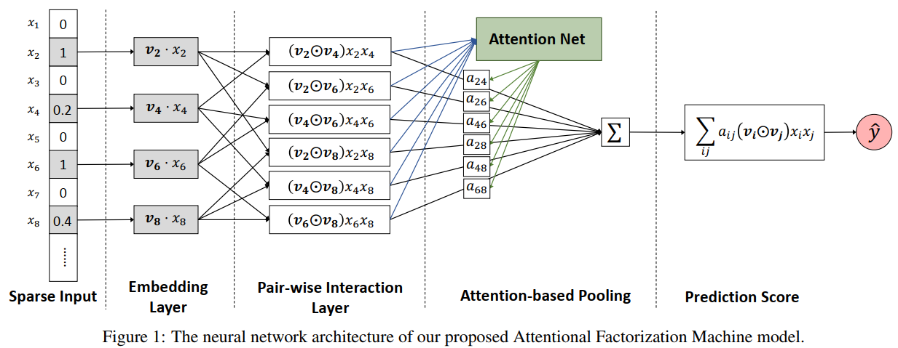

<!-- @import "[TOC]" {cmd="toc" depthFrom=1 depthTo=6 orderedList=false} -->

<!-- code_chunk_output -->

- [1. 动机](#1-动机)
- [AFM模型原理](#afm模型原理)
  - [2.1 Pair-wise Interaction Layer](#21-pair-wise-interaction-layer)
  - [2.2 Attention-based Pooling](#22-attention-based-pooling)
  - [2.3 AFM模型训练](#23-afm模型训练)

<!-- /code_chunk_output -->

### 1. 动机

AFM的全称是Attentional Factorization Machines, 从模型的名称上来看是在FM的基础上加上了注意力机制，FM是通过特征隐向量的内积来对交叉特征进行建模，从公式中可以看出所有的交叉特征都具有相同的权重也就是1，没有考虑到不同的交叉特征的重要性程度： $$ y_{fm} = w_0+\sum_{i=1}^nw_ix_i+\sum_{i=1}^{n}\sum_{i+1}^n\lt v_i,v_j\gt x_ix_j $$ 如何让不同的交叉特征具有不同的重要性就是AFM核心的贡献，在谈论AFM交叉特征注意力之前，对于FM交叉特征部分的改进还有FFM，其是考虑到了对于不同的其他特征，某个指定特征的隐向量应该是不同的（相比于FM对于所有的特征只有一个隐向量，FFM对于一个特征有多个不同的隐向量）。
<!--more-->

###  AFM模型原理

上图表示的就是AFM交叉特征部分的模型结构(非交叉部分与FM是一样的，图中并没有给出)。AFM最核心的两个点分别是Pair-wise Interaction Layer和Attention-based Pooling。前者将输入的非零特征的隐向量两两计算element-wise product(哈达玛积，两个向量对应元素相乘，得到的还是一个向量)，假如输入的特征中的非零向量的数量为m，那么经过Pair-wise Interaction Layer之后输出的就是$\frac{m(m-1)}{2}$个向量，再将前面得到的交叉特征向量组输入到Attention-based Pooling，该pooling层会先计算出每个特征组合的自适应权重(通过Attention Net进行计算)，通过加权求和的方式将向量组压缩成一个向量，由于最终需要输出的是一个数值，所以还需要将前一步得到的向量通过另外一个向量将其映射成一个值，得到最终的基于注意力加权的二阶交叉特征的输出。(对于这部分如果不是很清楚，可以先看下面对两个核心层的介绍)

#### 2.1 Pair-wise Interaction Layer
FM二阶交叉项：所有非零特征对应的隐向量两两点积再求和，输出的是一个数值 $$ \sum_{i=1}^{n}\sum_{i+1}^n\lt v_i,v_j\gt x_ix_j $$ AFM二阶交叉项(无attention)：所有非零特征对应的隐向量两两对应元素乘积，然后再向量求和，输出的还是一个向量。 $$ \sum_{i=1}^{n}\sum_{i+1}^n (v_i \odot v_j) x_ix_j $$ 上述写法是为了更好的与FM进行对比，下面将公式变形方便与原论文中保持一致。首先是特征的隐向量。从上图中可以看出，作者对数值特征也对应了一个隐向量，不同的数值乘以对应的隐向量就可以得到不同的隐向量，相对于one-hot编码的特征乘以1还是其本身(并没有什么变化)，其实就是为了将公式进行统一。虽然论文中给出了对数值特征定义隐向量，但是在作者的代码中并没有发现有对数值特征进行embedding的过程(原论文代码链接）具体原因不详。

按照论文的意思，特征的embedding可以表示为：$\varepsilon = {v_ix_i}$，经过Pair-wise Interaction Layer输出可得： $$ f_{PI}(\varepsilon)={(v_i \odot v_j) x_ix_j}\ \ \ \ {i,j \in R_x} $$ $R_x$表示的是有效特征集合。此时的$f{PI}(\varepsilon)$表示的是一个向量集合，所以需要先将这些向量集合聚合成一个向量，然后在转换成一个数值： $$ \hat{y} = p^T \sum_{(i,j)\in R_x}(v_i \odot v_j) x_ix_j + b $$ 上式中的求和部分就是将向量集合聚合成一个维度与隐向量维度相同的向量，通过向量$p$再将其转换成一个数值，b表示的是偏置。

从开始介绍Pair-wise Interaction Layer到现在解决的一个问题是，如何将使用哈达玛积得到的交叉特征转换成一个最终输出需要的数值，到目前为止交叉特征之间的注意力权重还没有出现。在没有详细介绍注意力之前先感性的认识一下如果现在已经有了每个交叉特征的注意力权重，那么交叉特征的输出可以表示为： $$ \hat{y} = p^T \sum_{(i,j)\in R_x}\alpha_{ij}(v_i \odot v_j) x_ix_j + b $$ 就是在交叉特征得到的新向量前面乘以一个注意力权重$\alpha_{ij}$, 那么这个注意力权重如何计算得到呢？

#### 2.2 Attention-based Pooling
对于神经网络注意力相关的基础知识大家可以去看一下邱锡鹏老师的《神经网络与深度学习》第8章注意力机制与外部记忆。这里简单的叙述一下使用MLP实现注意力机制的计算。假设现在有n个交叉特征(假如维度是k)，将nxk的数据输入到一个kx1的全连接网络中，输出的张量维度为nx1，使用softmax函数将nx1的向量的每个维度进行归一化，得到一个新的nx1的向量，这个向量所有维度加起来的和为1，每个维度上的值就可以表示原nxk数据每一行(即1xk的数据)的权重。用公式表示为： $$ \alpha_{ij}' = h^T ReLU(W(v_i \odot v_j)x_ix_j + b) $$ 使用softmax归一化可得： $$ \alpha_{ij} = \frac{exp(\alpha_{ij}')}{\sum_{(i,j)\in R_x}exp(\alpha_{ij}')} $$ 这样就得到了AFM二阶交叉部分的注意力权重，如果将AFM的一阶项写在一起，AFM模型用公式表示为： $$ \hat{y}_{afm}(x) = w_0+\sum{i=1}^nw_ix_i+p^T \sum_{(i,j)\in R_x}\alpha_{ij}(v_i \odot v_j) x_ix_j + b $$

#### 2.3 AFM模型训练

AFM从最终的模型公式可以看出与FM的模型公式是非常相似的，所以也可以和FM一样应用于不同的任务，例如分类、回归及排序（不同的任务的损失函数是不一样的），AFM也有对防止过拟合进行处理：

1. 在Pair-wise Interaction Layer层的输出结果上使用dropout防止过拟合，因为并不是所有的特征组合对预测结果都有用，所以随机的去除一些交叉特征，让剩下的特征去自适应的学习可以更好的防止过拟合。
2. 对Attention-based Pooling层中的权重矩阵$W$使用L2正则，作者没有在这一层使用dropout的原因是发现同时在特征交叉层和注意力层加dropout会使得模型训练不稳定，并且性能还会下降。

加上正则参数之后的回归任务的损失函数表示为： $$ L = \sum_{x\in T} (\hat{y}_{afm}(x) - y(x))^2 + \lambda ||W||^2 $$