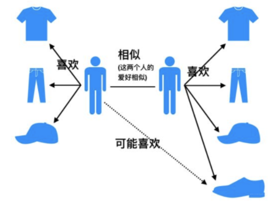
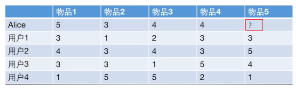

<!-- @import "[TOC]" {cmd="toc" depthFrom=1 depthTo=6 orderedList=false} -->

<!-- code_chunk_output -->

- [1. 协调过滤算法](#1-协调过滤算法)
- [2. 相似性度量方法](#2-相似性度量方法)
- [3. 基于用户的协同过滤](#3-基于用户的协同过滤)
- [4. 编程实现](#4-编程实现)
- [5. UserCF 优缺点](#5-usercf-优缺点)
- [6. 算法评估](#6-算法评估)
- [7.协同过滤算法的问题分析](#7协同过滤算法的问题分析)

<!-- /code_chunk_output -->

### 1. 协调过滤算法

所谓协同过滤， 基本思想是根据用户之前的喜好以及其他兴趣相近的用户的选择来给用户推荐物品(基于对用户历史行为数据的挖掘发现用户的喜好偏向， 并预测用户可能喜好的产品进行推荐)，一般是仅仅基于用户的行为数据（评价、购买、下载等）, 而不依赖于项的任何附加信息（物品自身特征）或者用户的任何附加信息（年龄， 性别等）。
<br>
目前应用比较广泛的协同过滤算法是基于邻域的方法， 而这种方法主要有下面两种算法：

+ 基于用户的协同过滤算法(UserCF): 给用户推荐和他兴趣相似的其他用户喜欢的产品
+基于物品的协同过滤算法(ItemCF): 给用户推荐和他之前喜欢的物品相似的物品

不管是UserCF还是ItemCF算法， 非常重要的步骤之一就是计算用户和用户或者物品和物品之间的相似度， 所以下面先整理常用的相似性度量方法， 然后再对每个算法的具体细节进行展开。
<!--more-->
### 2. 相似性度量方法
1. jaccard相似系数
   这个是衡量两个集合的相似度一种指标。两个用户$u$和$v$交互商品交集的数量占这两个用户交互商品并集的数量的比例，称为两个集合的杰卡德相似系数，用符号$sim_{uv}$表示，其中$N(u),N(v)$分别表示用户$u$和用户$v$交互商品的集合。 $$ sim_{uv}=\frac{|N(u) \cap N(v)|}{\sqrt{|N(u)| \cup|N(v)|}} $$ 由于杰卡德相似系数一般无法反映具体用户的评分喜好信息， 所以常用来评估用户是否会对某商品进行打分， 而不是预估用户会对某商品打多少分。
2. 余弦相似度
   余弦相似度衡量了两个向量的夹角，夹角越小越相似。首先从集合的角度描述余弦相似度，相比于Jaccard公式来说就是分母有差异，不是两个用户交互商品的并集的数量，而是两个用户分别交互的商品数量的乘积，公式如下： $$ sim_{uv}=\frac{|N(u) \cap N(v)|}{\sqrt{|N(u)|\cdot|N(v)|}} $$ 从向量的角度进行描述，令矩阵$A$为用户-商品交互矩阵(因为是TopN推荐并不需要用户对物品的评分，只需要知道用户对商品是否有交互就行)，即矩阵的每一行表示一个用户对所有商品的交互情况，有交互的商品值为1没有交互的商品值为0，矩阵的列表示所有商品。若用户和商品数量分别为$m,n$的话，交互矩阵$A$就是一个$m$行$n$列的矩阵。此时用户的相似度可以表示为(其中$u\cdot v$指的是向量点积)： $$ sim_{uv} = cos(u,v) =\frac{u\cdot v}{|u|\cdot |v|} $$ 上述用户-商品交互矩阵在现实情况下是非常的稀疏了，为了避免存储这么大的稀疏矩阵，在计算用户相似度的时候一般会采用集合的方式进行计算。理论上向量之间的相似度计算公式都可以用来计算用户之间的相似度，但是会根据实际的情况选择不同的用户相似度度量方法。
3. 皮尔逊相关系数
   皮尔逊相关系数的公式与余弦相似度的计算公式非常的类似，首先对于上述的余弦相似度的计算公式写成求和的形式,其中$r_{ui},r_{vi}$分别表示用户$u$和用户$v$对商品$i$是否有交互(或者具体的评分值)： $$ sim_{uv} = \frac{\sum_i r_{ui}*r_{vi}}{\sqrt{\sum_i r_{ui}^2}\sqrt{\sum_i r_{vi}^2}} $$ 如下是皮尔逊相关系数计算公式，其中$r_{ui},r_{vi}$分别表示用户$u$和用户$v$对商品$i$是否有交互(或者具体的评分值)，$\bar r_u, \bar r_v$分别表示用户$u$和用户$v$交互的所有商品交互数量或者具体评分的平均值。 $$ sim(u,v)=\frac{\sum_{i\in I}(r_{ui}-\bar r_u)(r_{vi}-\bar r_v)}{\sqrt{\sum_{i\in I }(r_{ui}-\bar r_u)^2}\sqrt{\sum_{i\in I }(r_{vi}-\bar r_v)^2}} $$ 所以相比余弦相似度，皮尔逊相关系数通过使用用户的平均分对各独立评分进行修正，减小了用户评分偏置的影响。

### 3. 基于用户的协同过滤
<br>
基于用户的协同过滤（以下用UserCF表示），思想其实比较简单，当一个用户A需要个性化推荐的时候， 我们可以先找到和他有相似兴趣的其他用户， 然后把那些用户喜欢的， 而用户A没有听说过的物品推荐给A。



UserCF算法主要两个步骤：

1. 找到和目标用户兴趣相似的集合
2. 找到这个集合中的用户喜欢的，且目标用户没有听说过的产品推荐给目标用户


应用UserCF算法的两个步骤：

1. 首先根据前面的这些打分情况(或者说已有的用户向量）计算一下Alice和用户1， 2， 3， 4的相似程度， 找出与Alice最相似的n个用户
2. 根据这n个用户对物品5的评分情况和与Alice的相似程度会猜测出Alice对物品5的评分， 如果评分比较高的话， 就把物品5推荐给用户Alice， 否则不推荐。

根据上面的几种方法， 我们可以计算出向量之间的相似程度， 也就是可以计算出Alice和其他用户的相近程度， 这时候我们就可以选出与Alice最相近的前n个用户， 基于他们对物品5的评价猜测出Alice的打分值， 那么是怎么计算的呢？

这里常用的方式之一是利用用户相似度和相似用户的评价加权平均获得用户的评价预测， 用下面式子表示：

$$ R_{\mathrm{u}, \mathrm{p}}=\frac{\sum_{\mathrm{s} \in S}\left(w_{\mathrm{u}, \mathrm{s}} \cdot R_{\mathrm{s}, \mathrm{p}}\right)}{\sum_{\mathrm{s} \in S} w_{\mathrm{u}, \mathrm{s}}} $$ 这个式子里面， 权重$w_{u,s}$是用户$u$和用户$s$的相似度， $R_{s,p}$是用户$s$对物品$p$的评分。

还有一种方式如下， 这种方式考虑的更加全面， 依然是用户相似度作为权值， 但后面不单纯的是其他用户对物品的评分， 而是该物品的评分与此用户的所有评分的差值进行加权平均， 这时候考虑到了有的用户内心的评分标准不一的情况， 即有的用户喜欢打高分， 有的用户喜欢打低分的情况。

$$ P_{i, j}=\bar{R}{i}+\frac{\sum_{k=1}^{n}\left(S_{i, k}\left(R_{k, j}-\bar{R}_{k}\right)\right)}{\sum_{k=1}^{n} S_{j, k}} $$ 所以这一种计算方式更为推荐。

在获得用户$u$对不同物品的评价预测后， 最终的推荐列表根据预测评分进行排序得到。

### 4. 编程实现
 梳理一下上面的过程其实就是三步： 计算用户相似性矩阵、得到前n个相似用户、计算最终得分。


1. 首先， 先把数据表给建立起来

```
# 定义数据集， 也就是那个表格， 注意这里我们采用字典存放数据， 因为实际情况中数据是非常稀疏的， 很少有情况是现在这样
def loadData():
    items={'A': {1: 5, 2: 3, 3: 4, 4: 3, 5: 1},
           'B': {1: 3, 2: 1, 3: 3, 4: 3, 5: 5},
           'C': {1: 4, 2: 2, 3: 4, 4: 1, 5: 5},
           'D': {1: 4, 2: 3, 3: 3, 4: 5, 5: 2},
           'E': {2: 3, 3: 5, 4: 4, 5: 1}
          }
    users={1: {'A': 5, 'B': 3, 'C': 4, 'D': 4},
           2: {'A': 3, 'B': 1, 'C': 2, 'D': 3, 'E': 3},
           3: {'A': 4, 'B': 3, 'C': 4, 'D': 3, 'E': 5},
           4: {'A': 3, 'B': 3, 'C': 1, 'D': 5, 'E': 4},
           5: {'A': 1, 'B': 5, 'C': 5, 'D': 2, 'E': 1}
          }
    return items,users

items, users = loadData()
item_df = pd.DataFrame(items).T
user_df = pd.DataFrame(users).T
```
2. 计算用户相似性矩阵
```
"""计算用户相似性矩阵"""
similarity_matrix = pd.DataFrame(np.zeros((len(users), len(users))), index=[1, 2, 3, 4, 5], columns=[1, 2, 3, 4, 5])

# 遍历每条用户-物品评分数据
for userID in users:
    for otheruserId in users:
        vec_user = []
        vec_otheruser = []
        if userID != otheruserId:
            for itemId in items:   # 遍历物品-用户评分数据
                itemRatings = items[itemId]        # 这也是个字典  每条数据为所有用户对当前物品的评分
                if userID in itemRatings and otheruserId in itemRatings:  # 说明两个用户都对该物品评过分
                    vec_user.append(itemRatings[userID])
                    vec_otheruser.append(itemRatings[otheruserId])
            # 这里可以获得相似性矩阵(共现矩阵)
            similarity_matrix[userID][otheruserId] = np.corrcoef(np.array(vec_user), np.array(vec_otheruser))[0][1]
            #similarity_matrix[userID][otheruserId] = cosine_similarity(np.array(vec_user), np.array(vec_otheruser))[0][1]


```
3.计算前n个相似的用户

```
"""计算前n个相似的用户"""
n = 2
similarity_users = similarity_matrix[1].sort_values(ascending=False)[:n].index.tolist()    # [2, 3]   也就是用户1和用户2

```
4. 计算最终得分
```
"""计算最终得分"""
base_score = np.mean(np.array([value for value in users[1].values()]))
weighted_scores = 0.
corr_values_sum = 0.
for user in similarity_users:  # [2, 3]
    corr_value = similarity_matrix[1][user]            # 两个用户之间的相似性
    mean_user_score = np.mean(np.array([value for value in users[user].values()]))    # 每个用户的打分平均值
    weighted_scores += corr_value * (users[user]['E']-mean_user_score)      # 加权分数
    corr_values_sum += corr_value
final_scores = base_score + weighted_scores / corr_values_sum
print('用户Alice对物品5的打分: ', final_scores)
user_df.loc[1]['E'] = final_scores
user_df


```

### 5. UserCF 优缺点
两大问题：
    1. 数据稀疏性。 一个大型的电子商务推荐系统一般有非常多的物品，用户可能买的其中不到1%的物品，不同用户之间买的物品重叠性较低，导致算法无法找到一个用户的邻居，即偏好相似的用户。这导致UserCF不适用于那些正反馈获取较困难的应用场景(如酒店预订， 大件商品购买等低频应用)
    2. 算法扩展性。 基于用户的协同过滤需要维护用户相似度矩阵以便快速的找出Topn相似用户， 该矩阵的存储开销非常大，存储空间随着用户数量的增加而增加，不适合用户数据量大的情况使用。

### 6. 算法评估

1. 召回率
   对用户u推荐N个物品记为$R(u)$, 令用户u在测试集上喜欢的物品集合为$T(u)$， 那么召回率定义为： $$ \operatorname{Recall}=\frac{\sum_{u}|R(u) \cap T(u)|}{\sum_{u}|T(u)|} $$ 这个意思就是说， 在用户真实购买或者看过的影片里面， 我模型真正预测出了多少， 这个考察的是模型推荐的一个全面性。
2. 准确率
    准确率定义为： $$ \operatorname{Precision}=\frac{\sum_{u} \mid R(u) \cap T(u)|}{\sum_{u}|R(u)|} $$ 这个意思再说， 在我推荐的所有物品中， 用户真正看的有多少， 这个考察的是我模型推荐的一个准确性。 为了提高准确率， 模型需要把非常有把握的才对用户进行推荐， 所以这时候就减少了推荐的数量， 而这往往就损失了全面性， 真正预测出来的会非常少，所以实际应用中应该综合考虑两者的平衡。
3. 覆盖率
   覆盖率反映了推荐算法发掘长尾的能力， 覆盖率越高， 说明推荐算法越能将长尾中的物品推荐给用户。 $$ \text { Coverage }=\frac{\left|\bigcup_{u \in U} R(u)\right|}{|I|} $$
4. 新颖度
   用户推荐列表中物品的平均流行度度量推荐结果的新颖度。 如果推荐出的物品都很热门， 说明推荐的新颖度较低。 由于物品的流行度分布呈长尾分布， 所以为了流行度的平均值更加稳定， 在计算平均流行度时对每个物品的流行度取对数。

### 7.协同过滤算法的问题分析
协同过滤算法存在的问题之一就是泛化能力弱， 即协同过滤无法将两个物品相似的信息推广到其他物品的相似性上。 导致的问题是热门物品具有很强的头部效应， 容易跟大量物品产生相似， 而尾部物品由于特征向量稀疏， 导致很少被推荐。