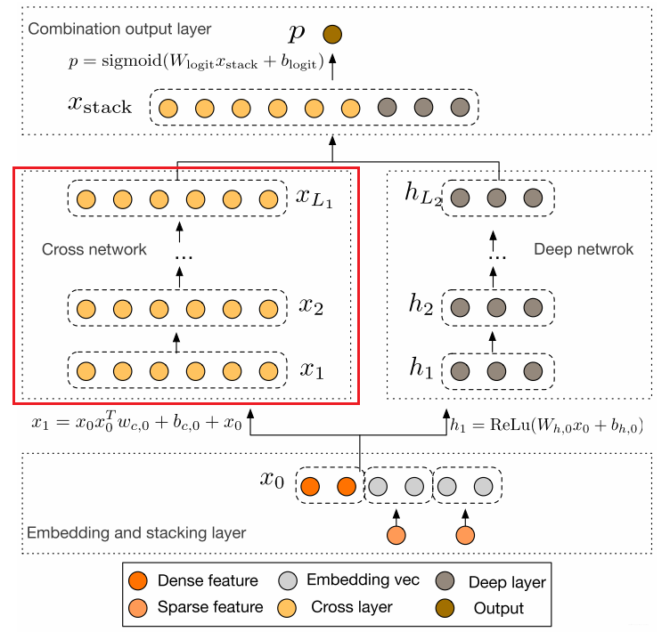
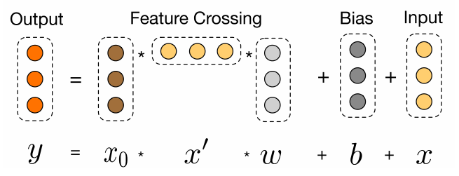

<!-- @import "[TOC]" {cmd="toc" depthFrom=1 depthTo=6 orderedList=false} -->

<!-- code_chunk_output -->

- [1. 动机](#1-动机)
- [2. 模型结构与原理](#2-模型结构与原理)
  - [2.1 Embedding和Stacking 层](#21-embedding和stacking-层)
  - [2.2 Cross Network](#22-cross-network)

<!-- /code_chunk_output -->

### 1. 动机
Wide&Deep模型的提出不仅综合了“记忆能力”和“泛化能力”， 而且开启了不同网络结构融合的新思路。 所以后面就有各式各样的模型改进Wide部分或者Deep部分， 而Deep&Cross模型(DCN)就是其中比较典型的一个，这是2017年斯坦福大学和谷歌的研究人员在ADKDD会议上提出的， 该模型针对W&D的wide部分进行了改进， 因为Wide部分有一个不足就是需要人工进行特征的组合筛选， 过程繁琐且需要经验， 而2阶的FM模型在线性的时间复杂度中自动进行特征交互，但是这些特征交互的表现能力并不够，并且随着阶数的上升，模型复杂度会大幅度提高。于是乎，作者用一个Cross Network替换掉了Wide部分，来自动进行特征之间的交叉，并且网络的时间和空间复杂度都是线性的。 通过与Deep部分相结合，构成了深度交叉网络（Deep & Cross Network），简称DCN。
<!--more-->
### 2. 模型结构与原理

这个模型的结构也是比较简洁的， 从上到下依次为：Embedding和Stacking层， Cross网络层与Deep网络层并列， 以及最后的输出层。

#### 2.1 Embedding和Stacking 层
Embedding层我们已经非常的熟悉了吧， 这里的作用依然是把稀疏离散的类别型特征变成低维密集型。 $$ \mathbf{x}_{\text {embed, } i}=W_{\text {embed, } i} \mathbf{x}_{i} $$ 其中对于某一类稀疏分类特征（如id），$X_{embed, i}$是第$i$个分类值（id序号）的embedding向量。$W_{embed,i}$是embedding矩阵， $n_e\times n_v$维度， $n_e$是embedding维度， $n_v$是该类特征的唯一取值个数。$x_i$属于该特征的二元稀疏向量(one-hot)编码的。 【实质上就是在训练得到的Embedding参数矩阵中找到属于当前样本对应的Embedding向量】。其实绝大多数基于深度学习的推荐模型都需要Embedding操作，参数学习是通过神经网络进行训练。

最后，该层需要将所有的密集型特征与通过embedding转换后的特征进行联合（Stacking）： $$ \mathbf{x}{0}=\left[\mathbf{x}_{\text {embed, } 1}^{T}, \ldots, \mathbf{x}_{\text {embed, }, k}^{T}, \mathbf{x}_{\text {dense }}^{T}\right] $$ 一共$k$个类别特征， dense是数值型特征， 两者在特征维度拼在一块。 上面的这两个操作如果是看了前面的模型的话，应该非常容易理解了。

#### 2.2 Cross Network
这个就是本模型最大的亮点了---Cross网络， 这个思路感觉非常Nice。设计该网络的目的是增加特征之间的交互力度。交叉网络由多个交叉层组成， 假设$l$层的输出向量$x_l$， 那么对于第$l+1$层的输出向量$x_{l+1}$表示为：

$$ \mathbf{x}_{l+1}=\mathbf{x}_{0} \mathbf{x}_{l}^{T} \mathbf{w}_{l}+\mathbf{b}_{l}+\mathbf{x}_{l}=f\left(\mathbf{x}_{l}, \mathbf{w}_{l}, \mathbf{b}_{l}\right)+\mathbf{x}_{l} $$ 可以看到， 交叉层的操作的二阶部分非常类似PNN提到的外积操作， 在此基础上增加了外积操作的权重向量$w_l$， 以及原输入向量$x_l$和偏置向量$b_l$。 交叉层的可视化如下：

可以看到， 每一层增加了一个$n$维的权重向量$w_l$（n表示输入向量维度）， 并且在每一层均保留了输入向量， 因此输入和输出之间的变化不会特别明显。关于这一层， 原论文里面有个具体的证明推导Cross Network为啥有效， 不过比较复杂，这里我拿一个式子简单的解释下上面这个公式的伟大之处：
>我们根据上面这个公式， 尝试的写前面几层看看:
>
>$l$ =0: $\mathbf{x}{1} =\mathbf{x}{0} \mathbf{x}{0}^{T} \mathbf{w}{0}+ \mathbf{b}{0}+\mathbf{x}{0}$
>
>$l=1:\mathbf{x}{2} =\mathbf{x}{0} \mathbf{x}{1}^{T} \mathbf{w}{1}+ \mathbf{b}{1}+\mathbf{x}{1}=\mathbf{x}{0} [\mathbf{x}{0} \mathbf{x}{0}^{T} \mathbf{w}{0}+ \mathbf{b}{0}+\mathbf{x}{0}]^{T}\mathbf{w}{1}+\mathbf{b}{1}+\mathbf{x}_{1}$
>
>$l=2:\mathbf{x}{3} =\mathbf{x}{0} \mathbf{x}{2}^{T} \mathbf{w}{2}+ \mathbf{b}{2}+\mathbf{x}{2}=\mathbf{x}{0} [\mathbf{x}{0} [\mathbf{x}{0} \mathbf{x}{0}^{T} \mathbf{w}{0}+ \mathbf{b}{0}+\mathbf{x}{0}]^{T}\mathbf{w}{1}+\mathbf{b}{1}+\mathbf{x}{1}]^{T}\mathbf{w}{2}+\mathbf{b}{2}+\mathbf{x}_{2}$

我们暂且写到第3层的计算， 我们会发现什么结论呢？ 给大家总结一下：
1. $\mathrm{x}_1$中包含了所有的$\mathrm{x}_0$的1,2阶特征的交互， $\mathrm{x}_2$包含了所有的$\mathrm{x}_1, \mathrm{x}_0$的1， 2， 3阶特征的交互，$\mathrm{x}_3$中包含了所有的$\mathrm{x}_2$, $\mathrm{x}_1$与$\mathrm{x}_0$的交互，$\mathrm{x}_0$的1,2,3,4阶特征交互。 因此， 交叉网络层的叉乘阶数是有限的。 第$l$层特征对应的最高的叉乘阶数$l+1$

2. Cross网络的参数是共享的， 每一层的这个权重特征之间共享， 这个可以使得模型泛化到看不见的特征交互作用， 并且对噪声更具有鲁棒性。 例如两个稀疏的特征$x_i,x_j$， 它们在数据中几乎不发生交互， 那么学习$x_i,x_j$的权重对于预测没有任何的意义。

3. 计算交叉网络的参数数量。 假设交叉层的数量是$L_c$， 特征$x$的维度是$n$， 那么总共的参数是：
$$ n\times L_c \times 2 $$ 这个就是每一层会有$w$和$b$。且$w$维度和$x$的维度是一致的。

4. 交叉网络的时间和空间复杂度是线性的。这是因为， 每一层都只有$w$和$b$， 没有激活函数的存在，相对于深度学习网络， 交叉网络的复杂性可以忽略不计。

5. Cross网络是FM的泛化形式， 在FM模型中， 特征$x_i$的权重$v_i$， 那么交叉项$x_i,x_j$的权重为$<x_i,x_j>$。在DCN中， $x_i$的权重为${W_K^{(i)}}{k=1}^l$, 交叉项$x_i,x_j$的权重是参数${W_K^{(i)}}{k=1}^l$和${W_K^{(j)}}_{k=1}^l$的乘积，这个看上面那个例子展开感受下。因此两个模型都各自学习了独立于其他特征的一些参数，并且交叉项的权重是相应参数的某种组合。FM只局限于2阶的特征交叉(一般)，而DCN可以构建更高阶的特征交互， 阶数由网络深度决定，并且交叉网络的参数只依据输入的维度线性增长。

6. 还有一点我们也要了解，对于每一层的计算中， 都会跟着$\mathrm{x}_0$, 这个是咱们的原始输入， 之所以会乘以一个这个，是为了保证后面不管怎么交叉，都不能偏离我们的原始输入太远，别最后交叉交叉都跑偏了。

7. $\mathbf{x}{l+1}=f\left(\mathbf{x}{l}, \mathbf{w}{l}, \mathbf{b}{l}\right)+\mathbf{x}_{l}$, 这个东西其实有点跳远连接的意思，也就是和ResNet也有点相似，无形之中还能有效的缓解梯度消失现象。