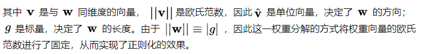

LN：Layer Normalization，LN是“横”着来的，对一个样本，不同的神经元neuron间做归一化。

BN：Batch Normalization，BN是“竖”着来的，各个维度做归一化，所以与batch size有关系。

**优点：**Bactch Normalization通过标准化让激活函数分布在线性区间，结果就是加大了梯度，让模型更大胆的进行梯度下降，具有如下优点：

- 加大搜索的步长，加快收敛的速度；
- 更容易跳出局部最小值；
- 破坏原来的数据分布，一定程度上缓解了过拟合

**缺陷如下：**

1、BN是在batch size样本上各个维度做标准化的，所以size越大肯定越能得出合理的μ和σ来做标准化，因此BN比较依赖size的大小。
2、在训练的时候，是分批量进行填入模型的，但是在预测的时候，如果只有一个样本或者很少量的样本来做inference，这个时候用BN显然偏差很大，例如在线学习场景。
3、RNN是一个动态的网络，也就是size是变化的，可大可小，造成多样本维度都没法对齐，所以不适合用BN。

**LN带来的优势：**

1、Layer Normalization是每个样本内部做标准化，跟size没关系，不受其影响。
2、RNN中LN也不受影响，内部自己做标准化，所以LN的应用面更广。

- BatchNorm：batch方向做归一化，计算N*H*W的均值
- LayerNorm：channel方向做归一化，计算C*H*W的均值
- InstanceNorm：一个channel内做归一化，计算H*W的均值
- GroupNorm：先将channel方向分group，然后每个group内做归一化，计算(C//G)*H*W的均值

# WN

# 归一化操作

# 参考资料

https://www.cnblogs.com/gczr/p/12597344.html

[详解深度学习中的Normalization，BN/LN/WN - 知乎 (zhihu.com)](https://zhuanlan.zhihu.com/p/33173246)

[为什么要做特征归一化/标准化？ - shine-lee - 博客园 (cnblogs.com)](https://www.cnblogs.com/shine-lee/p/11779514.html)

