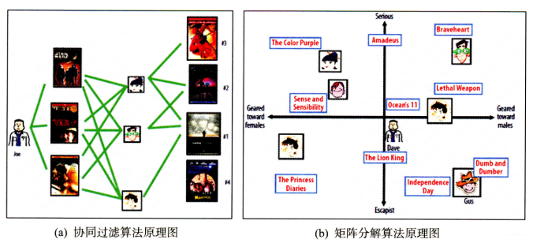
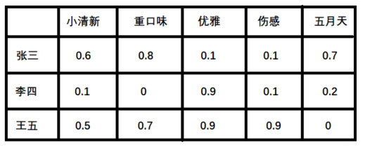
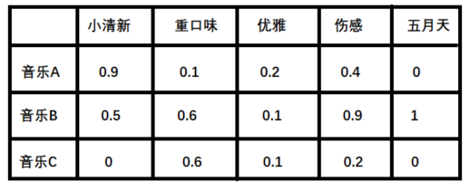
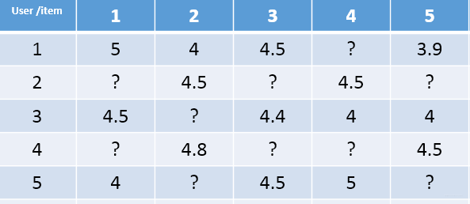
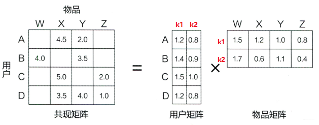
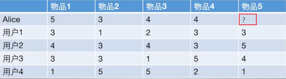

<!-- @import "[TOC]" {cmd="toc" depthFrom=1 depthTo=6 orderedList=false} -->

<!-- code_chunk_output -->

- [1. 隐语义模型与矩阵分解](#1-隐语义模型与矩阵分解)
- [2. 隐语义模型](#2-隐语义模型)
- [3.矩阵分解的原理](#3矩阵分解的原理)
- [4.矩阵分解的求解——Funk-SVD](#4矩阵分解的求解funk-svd)
- [5. 编程实现](#5-编程实现)
- [6. 优缺点](#6-优缺点)

<!-- /code_chunk_output -->

### 1. 隐语义模型与矩阵分解
协同过滤算法的特点就是完全没有利用到物品本身或者是用户自身的属性， 仅仅利用了用户与物品的交互信息就可以实现推荐，是一个可解释性很强， 非常直观的模型， 但是也存在一些问题， 第一个就是处理稀疏矩阵的能力比较弱， 所以为了使得协同过滤更好处理稀疏矩阵问题， 增强泛化能力， 从协同过滤中衍生出矩阵分解模型(Matrix Factorization,MF)或者叫隐语义模型, 两者差不多说的一个意思， 就是在协同过滤共现矩阵的基础上， 使用更稠密的隐向量表示用户和物品， 挖掘用户和物品的隐含兴趣和隐含特征， 在一定程度上弥补协同过滤模型处理稀疏矩阵能力不足的问题。
<!--more-->
### 2. 隐语义模型
隐语义模型最早在文本领域被提出，用于找到文本的隐含语义。在2006年， 被用于推荐中, **它的核心思想是通过隐含特征（latent factor）联系用户兴趣和物品（item）， 基于用户的行为找出潜在的主题和分类， 然后对item进行自动聚类，划分到不同类别/主题(用户的兴趣)。**
>如果我们知道了用户A和用户B两个用户在豆瓣的读书列表， 从他们的阅读列表可以看出，用户A的兴趣涉及侦探小说、科普图书以及一些计算机技术书， 而用户B的兴趣比较集中在数学和机器学习方面。 那么如何给A和B推荐图书呢？
>
>先说说协同过滤算法， 这样好对比不同：
>
>+ 对于UserCF，首先需要找到和他们看了同样书的其他用户（兴趣相似的用户），然后给他们推荐那些用户喜欢的其他书。
>+ 对于ItemCF，需要给他们推荐和他们已经看的书相似的书，比如作者B看了很多关于数据挖掘的书，可以给他推荐机器学习或者模式识别方面的书。
>
>而如果是隐语义模型的话， 它会先通过一些角度把用户兴趣和这些书归一下类， 当来了用户之后， 首先得到他的兴趣分类， 然后从这个分类中挑选他可能喜欢的书籍。

这里就看到了隐语义模型和协同过滤的不同， 这里说的角度其实就是这个隐含特征， 比如书籍的话它的内容， 作者， 年份， 主题等都可以算隐含特征，如果这个例子还不是很清晰的话， 那么下面再举个更为具体的例子， 看看是如何通过隐含特征来划分开用户兴趣和物品的。



假设每个用户都有自己的听歌偏好， 比如A喜欢带有小清新的， 吉他伴奏的， 王菲的歌曲，如果一首歌正好是王菲唱的， 并且是吉他伴奏的小清新， 那么就可以将这首歌推荐给这个用户。 也就是说是小清新， 吉他伴奏， 王菲这些元素连接起了用户和歌曲。 当然每个用户对不同的元素偏好不同， 每首歌包含的元素也不一样， 所以我们就希望找到下面的两个矩阵：
1. 潜在因子——用户矩阵Q
   这个矩阵表示不同用户对于不同元素的偏好程度，1表示很喜欢，0表示不喜欢
   
2. 潜在因子——音乐矩阵P
   表示每种音乐含有各种元素的成分， 比如下表中， 音乐A是一个偏小清新的音乐， 含有小清新的Latent Factor的成分是0.9， 重口味的成分是0.1， 优雅成分0.2.....
   

利用上面的这两个矩阵， 我们就能得出张三对音乐A的喜欢程度：
> 张三对小清新的偏好 * 音乐A含有小清新的成分 + 张三对重口味的偏好 * 音乐A含有重口味的成分 + 张三对优雅的偏好 * 音乐A含有优雅的成分....,

上面例子中的小清晰， 重口味， 优雅这些就可以看做是隐含特征， 而通过这个隐含特征就可以把用户的兴趣和音乐的进行一个分类， 其实就是找到了每个用户每个音乐的一个隐向量表达形式（embedding的原理其实也是这样， 那里是找到每个词的隐向量表达）， 这个隐向量就可以反映出用户的兴趣和物品的风格，并能将相似的物品推荐给相似的用户等。 有没有感觉到是把协同过滤算法进行了一种延伸， 把用户的相似性和物品的相似性通过了一个叫做隐向量的方式进行表达

但是， 真实的情况下我们其实是没有上面那两个矩阵的， 音乐那么多， 用户那么多， 我们没有办法去找一些隐特征去表示出这些东西， 另外一个问题就是即使能表示也不一定准， 对于每个用户或者每个物品的风格，我们每个人都有不同的看法。 所以事实上， 我们有的只有用户的评分矩阵， 也就是最后的结果， 并且一般这种矩阵长这样：


这种矩阵非常的稀疏，如果直接基于用户相似性或者物品相似性去填充这个矩阵是不太容易的， 并且很容易出现长尾问题， 所以矩阵分解就可以比较容易的解决这个问题。

矩阵分解模型其实就是在想办法基于这个评分矩阵去找到上面例子中的那两个矩阵， 也就是用户兴趣和物品的隐向量表达， 然后就把这个评分矩阵分解成Q和P两个矩阵乘积的形式， 这时候就可以基于这两个矩阵去预测某个用户对某个物品的评分了。 然后基于这个评分去进行推荐。这就是矩阵分解算法的原理。

### 3.矩阵分解的原理
在矩阵分解的算法框架下， 我们就可以通过分解协同过滤的共现矩阵来得到用户和物品的隐向量， 就是上面的用户矩阵Q和物品矩阵P， 这也是“矩阵分解”名字的由来。

矩阵分解算法将$m\times n$维的共享矩阵$R$分解成$m \times k$维的用户矩阵$U$和$k \times n$维的物品矩阵$V$相乘的形式。 其中$m$是用户数量， $n$是物品数量， $k$是隐向量维度， 也就是隐含特征个数， 只不过这里的隐含特征变得不可解释了， 即我们不知道具体含义了， 要模型自己去学。$k$的大小决定了隐向量表达能力的强弱， $k$越大， 表达信息就越强， 理解起来就是把用户的兴趣和物品的分类划分的越具体。

那么如果有了用户矩阵和物品矩阵的话， 我们就知道了如果想计算用户$u$对物品$i$的评分， 只需要 $$ \operatorname{Preference}(u, i)=r_{u i}=p_{u}^{T} q_{i}=\sum_{f=1}^{F} p_{u, k} q_{k,i} $$ 这里的$p_u$就是用户$u$的隐向量， 就类似与上面的张三向量， 注意这是列向量， $q_i$是物品$i$的隐向量， 就类似于上面的音乐A向量， 这个也是列向量， 所以才用了$p_{u}^{T} q_{i}$得到了一个数， 也就是用户的最终评分， 计算过程其实和上面例子中一样。 这里的$p_{u,k}$和$q_{i,k}$是模型的参数， 也正是我们想办法要计算的， $p_{u,k}$度量的是用户$u$的兴趣和第$k$个隐类的关系， 而$q_{i,k}$度量了第$k$个隐类和物品$i$之间的关系。

### 4.矩阵分解的求解——Funk-SVD
Funk-SVD的思想很简单： 把求解上面两个矩阵的参数问题转换成一个最优化问题， 可以通过训练集里面的观察值利用最小化来学习用户矩阵和物品矩阵。

我们上面已经知道了， 如果有了用户矩阵和物品矩阵的话， 我们就知道了如果想计算用户$u$对物品$i$的评分， 只需要 $$ \operatorname{Preference}(u, i)=r_{u i}=p_{u}^{T} q_{i}=\sum_{f=1}^{F} p_{u, k} q_{k,i} $$ 而现在， 我们有真实的$r_{u i}$, 但是没有$p_{u}^{T} q_{i}$, 那么我们可以初始化一个啊， 随机初始化一个用户矩阵$U$和一个物品矩阵$V$， 然后不就有$p_{u}^{T} q_{i}$了？ 当然你说， 随机初始化的肯定不准啊， 但是， 有了$p_{u}^{T} q_{i}$之后， 我们就可以计算一个猜测的$\hat{r}_{u i}$, 即 $$ \hat{r}_{u i}=p_{u}^{T} q_{i} $$

这时候， 肯定是不准， 那么这个猜测的和真实值之间就会有一个误差： $$ e_{u i}=r_{u i}-\hat{r}_{u i} $$

有了误差， 我们就可以计算出总的误差平方和： $$ \operatorname{SSE}=\sum_{u, i} e_{u i}^{2}=\sum_{u, i}\left(r_{u i}-\sum_{k=1}^{K} p_{u,k} q_{k, i}\right)^{2} $$ 有了损失， 我们就可以想办法进行训练， 把SSE降到最小， 那么我们的两个矩阵参数就可以算出来。所以就把这个问题转成了最优化的的问题， 而我们的目标函数就是：

$$ {\min}_{\boldsymbol{q}, \boldsymbol{p}} {\sum}_{(u, i) \in K}\left(\boldsymbol{r}_{\mathrm{ui}}-p_{u}^{T} q_{i}\right)^{2} $$

这里的$K$表示所有用户评分样本的集合。

有了目标函数， 那么我们就可以使用梯度下降算法来降低损失。 那么我们需要对目标函数求偏导， 得到梯度。 我们的目标函数如果是上面的SSE， 我们下面来推导一下最后的导数：

$$ \operatorname{SSE}=\sum_{u, i} e_{u i}^{2}=\sum_{u, i}\left(r_{u i}-\sum_{k=1}^{K} p_{u,k} q_{k,i}\right)^{2} $$ 首先我们求SSE在$p_{u,k}$（也就是Q矩阵的第$u$行$k$列）的梯度： $$ \frac{\partial}{\partial p_{u,k}} S S E=\frac{\partial}{\partial p_{u,k}}\left(e_{u i}^{2}\right) =2e_{u i} \frac{\partial}{\partial p_{u,k}} e_{u i}=2e_{u i} \frac{\partial}{\partial p_{u,k}}\left(r_{u i}-\sum_{k=1}^{K} p_{u,k} q_{k,i}\right)=-2e_{u i} q_{k,i} $$ 然后求SSE在$q_{k,i}$处(也就是V矩阵的第$k$行$i$列）的梯度：

$$ \frac{\partial}{\partial q_{k,i}} S S E=\frac{\partial}{\partial p_{k,i}}\left(e_{u i}^{2}\right) =2e_{u i} \frac{\partial}{\partial p_{k,i}} e_{u i}=2e_{u i} \frac{\partial}{\partial p_{k,i}}\left(r_{u i}-\sum_{k=1}^{K} p_{u,k} q_{k,i}\right)=-2e_{u i} p_{u,k} $$ 为了让公式更为简单， 把前面的2给他越掉， 即可以令SSE等于： $$ \operatorname{SSE}=\frac{1}{2} \sum_{u, i} e_{u i}^{2}=\frac{1}{2} \sum_{u, i}\left(r_{u i}-\sum_{k=1}^{K} p_{u k} q_{k i}\right)^{2} $$

这时候， 梯度就没有前面的系数了， 有了梯度， 接下来我们就可以用梯度下降算法更新梯度了： $$ p_{u, k}=p_{u,k}-\eta (-e_{ui}q_{k,i})=p_{u,k}+\eta e_{ui}q_{k,i} \ q_{k, i}=q_{k, i}-\eta (-e_{ui}p_{u,k})=q_{k, i}+\eta e_{ui}p_{u,k} $$

这里的$\eta$是学习率， 控制步长用的， 但上面这个有个问题就是当参数很多的时候， 就是两个矩阵很大的时候， 往往容易陷入过拟合的困境， 这时候， 就需要在目标函数上面加上正则化的损失， 就变成了RSVD， 关于RSVD的详细内容， 可以参考下面给出的链接， 由于篇幅原因， 这里不再过多的赘述。

但在实际中， 单纯的$\hat{r}_{u i}=p_{u}^{T} q_{i}$也是不够的， 还要考虑其他的一些因素， 比如一个评分系统， 有些固有的属性和用户物品无关， 而用户也有些属性和物品无关， 物品也有些属性和用户无关。 因此， Netfix Prize中提出了另一种LFM， 在原来的基础上加了偏置项， 来消除用户和物品打分的偏差， 即预测公式如下： $$ \hat{r}_{u i}=\mu+b_{u}+b_{i}+p_{u}^{T} \cdot q_{i} $$ 这个预测公式加入了3项偏置$\mu,b_u,b_i$, 作用如下：

$\mu$: 训练集中所有记录的评分的全局平均数。 在不同网站中， 因为网站定位和销售物品不同， 网站的整体评分分布也会显示差异。 比如有的网站中用户就喜欢打高分， 有的网站中用户就喜欢打低分。 而全局平均数可以表示网站本身对用户评分的影响。
$b_u$: 用户偏差系数， 可以使用用户$u$给出的所有评分的均值， 也可以当做训练参数。 这一项表示了用户的评分习惯中和物品没有关系的那种因素。 比如有些用户比较苛刻， 对什么东西要求很高， 那么他评分就会偏低， 而有些用户比较宽容， 对什么东西都觉得不错， 那么评分就偏高
$b_i$: 物品偏差系数， 可以使用物品$i$收到的所有评分的均值， 也可以当做训练参数。 这一项表示了物品接受的评分中和用户没有关系的因素。 比如有些物品本身质量就很高， 因此获得的评分相对比较高， 有的物品本身质量很差， 因此获得的评分相对较低。
加了用户和物品的打分偏差之后， 矩阵分解得到的隐向量更能反映不同用户对不同物品的“真实”态度差异， 也就更容易捕捉评价数据中有价值的信息， 从而避免推荐结果有偏。 注意此时的$SSE$会发生变化：
$$ \begin{array}{l} \operatorname{SSE}=\frac{1}{2} \sum_{u, i} e_{u i}^{2}+\frac{1}{2} \lambda \sum_{u}\left|\boldsymbol{p}_{u}\right|^{2}+\frac{1}{2} \lambda \sum_{i}\left|\boldsymbol{q}_{i}\right|^{2}+\frac{1}{2} \lambda \sum_{u} \boldsymbol{b}_{u}^{2}+\frac{1}{2} \lambda \sum_{i} \boldsymbol{b}_{i}^{2} \ =\frac{1}{2} \sum{u, i}\left(\boldsymbol{r}_{u i}-\boldsymbol{\mu}-\boldsymbol{b}_{u}-\boldsymbol{b}_{i}-\sum_{k=1}^{K} \boldsymbol{p}_{u k} \boldsymbol{q}_{k i}\right)^{2}+\frac{1}{2} \lambda \sum_{u}\left|\boldsymbol{p}_{u}\right|^{2}+\frac{1}{2} \lambda \sum_{i}\left|\boldsymbol{q}_{i}\right|^{2}+\frac{\mathbf{1}}{2} \lambda \sum_{u} {\boldsymbol{b}}_{u}^{2}+\frac{1}{2} \lambda \sum_{i} \boldsymbol{b}_{i}^{2} \end{array} $$ 此时如果把$b_u$和$b_i$当做训练参数的话， 那么它俩的梯度是：

$$ \frac{\partial}{\partial b_{u}} S S E=-e_{u i}+\lambda b_{u} \ \frac{\partial}{\partial b_{i}} S S E=-e_{u i}+\lambda b_{i} $$ 更新公式为： $$ \begin{aligned} \boldsymbol{b}{u}&=\boldsymbol{b}{\boldsymbol{u}}+\boldsymbol{\eta}\left(\boldsymbol{e}{u i}-\lambda \boldsymbol{b}{\boldsymbol{u}}\right) \ \boldsymbol{b}{\boldsymbol{i}} &=\boldsymbol{b}{\boldsymbol{i}}+\boldsymbol{\eta}\left(\boldsymbol{e}{\boldsymbol{u} i}-\lambda \boldsymbol{b}{\boldsymbol{i}}\right) \end{aligned} $$ 而对于$p_{u,k}$和$p_{k,i}$， 导数没有变化， 更新公式也没有变化。

### 5. 编程实现
我们这里用代码实现一下上面的算法来预测上一篇文章里面的那个预测Alice对物品5的评分， 看看矩阵分解到底是怎么进行预测或者是推荐的。 我把之前的例子拿过来：

任务就是根据这个评分矩阵， 猜测Alice对物品5的打分。

在实现SVD之前， 先来回忆一下ItemCF和UserCF对于这个问题的做法， 首先ItemCF的做法， 根据已有的用户打分计算物品之间的相似度， 得到物品的相似度矩阵， 根据这个相似度矩阵， 选择出前K个与物品5最相似的物品， 然后基于Alice对这K个物品的得分， 猜测Alice对物品5的得分， 有一个加权的计算公式。 UserCF的做法是根据用户对其他物品的打分， 计算用户之间的相似度， 选择出与Alice最相近的K个用户， 然后基于那K个用户对物品5的打分计算出Alice对物品5的打分。 但是， 这两种方式有个问题， 就是如果矩阵非常稀疏的话， 当然这个例子是个特例， 一般矩阵都是非常稀疏的， 那么预测效果就不好， 因为两个相似用户对同一物品打分的概率以及Alice同时对两个相似物品打分的概率可能都比较小。 另外， 这两种方法显然没有考虑到全局的物品或者用户， 只是基于了最相似的例子， 很可能有偏。


那么SVD在解决这个问题上是这么做的：

1. 首先， 它会先初始化用户矩阵P和物品矩阵Q， P的维度是[users_num, F], Q的维度是[item_nums, F]， 这个F是隐向量的维度。 也就是把通过隐向量的方式把用户的兴趣和F的特点关联了起来。 初始化这两个矩阵的方式很多， 但根据经验， 随机数需要和1/sqrt(F)成正比。 下面代码中会发现。
2. 有了两个矩阵之后， 我就可以根据用户已经打分的数据去更新参数， 这就是训练模型的过程， 方法很简单， 就是遍历用户， 对于每个用户， 遍历它打分的物品， 这样就拿到了该用户和物品的隐向量， 然后两者相乘加上偏置就是预测的评分， 这时候与真实评分有个差距， 根据上面的梯度下降就可以进行参数的更新

这样训练完之后， 我们就可以得到用户Alice和物品5的隐向量， 根据这个就可以预测Alice对物品5的打分。 下面的代码的逻辑就是上面这两步， 这里使用带有偏置项和正则项的那个SVD算法：
```
class SVD():
    def __init__(self, rating_data, F=5, alpha=0.1, lmbda=0.1, max_iter=100):
        self.F = F           # 这个表示隐向量的维度
        self.P = dict()          #  用户矩阵P  大小是[users_num, F]
        self.Q = dict()     # 物品矩阵Q  大小是[item_nums, F]
        self.bu = dict()   # 用户偏差系数
        self.bi = dict()    # 物品偏差系数
        self.mu = 1.0        # 全局偏差系数
        self.alpha = alpha   # 学习率
        self.lmbda = lmbda    # 正则项系数
        self.max_iter = max_iter    # 最大迭代次数
        self.rating_data = rating_data # 评分矩阵
        
        # 初始化矩阵P和Q, 方法很多， 一般用随机数填充， 但随机数大小有讲究， 根据经验， 随机数需要和1/sqrt(F)成正比
        cnt = 0    # 统计总的打分数， 初始化mu用
        for user, items in self.rating_data.items():
            self.P[user] = [random.random() / math.sqrt(self.F)  for x in range(0, F)]
            self.bu[user] = 0
            cnt += len(items) 
            for item, rating in items.items():
                if item not in self.Q:
                    self.Q[item] = [random.random() / math.sqrt(self.F) for x in range(0, F)]
                    self.bi[item] = 0
        self.mu /= cnt
        
    # 有了矩阵之后， 就可以进行训练, 这里使用随机梯度下降的方式训练参数P和Q
    def train(self):
        for step in range(self.max_iter):
            for user, items in self.rating_data.items():
                for item, rui in items.items():
                    rhat_ui = self.predict(user, item)   # 得到预测评分
                    # 计算误差
                    e_ui = rui - rhat_ui
                    
                    self.bu[user] += self.alpha * (e_ui - self.lmbda * self.bu[user])
                    self.bi[item] += self.alpha * (e_ui - self.lmbda * self.bi[item])
                    # 随机梯度下降更新梯度
                    for k in range(0, self.F):
                        self.P[user][k] += self.alpha * (e_ui*self.Q[item][k] - self.lmbda * self.P[user][k])
                        self.Q[item][k] += self.alpha * (e_ui*self.P[user][k] - self.lmbda * self.Q[item][k])
                    
            self.alpha *= 0.1    # 每次迭代步长要逐步缩小
    
    # 预测user对item的评分， 这里没有使用向量的形式
    def predict(self, user, item):
        return sum(self.P[user][f] * self.Q[item][f] for f in range(0, self.F)) + self.bu[user] + self.bi[item] + self.mu   

```

### 6. 优缺点
+ 优点：
    - 泛化能力强： 一定程度上解决了稀疏问题
    - 空间复杂度低： 由于用户和物品都用隐向量的形式存放， 少了用户和物品相似度矩阵， 空间复杂度由$n^2$降到了$(n+m)*f$
    - 更好的扩展性和灵活性：矩阵分解的最终产物是用户和物品隐向量， 这个深度学习的embedding思想不谋而合， 因此矩阵分解的结果非常便于与其他特征进行组合和拼接， 并可以与深度学习无缝结合。

但是， 矩阵分解算法依然是只用到了评分矩阵， 没有考虑到用户特征， 物品特征和上下文特征， 这使得矩阵分解丧失了利用很多有效信息的机会， 同时在缺乏用户历史行为的时候， 无法进行有效的推荐。 所以为了解决这个问题， 逻辑回归模型及后续的因子分解机模型， 凭借其天然的融合不同特征的能力， 逐渐在推荐系统领域得到了更广泛的应用。