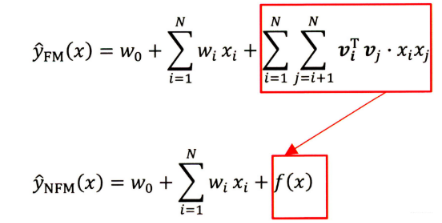
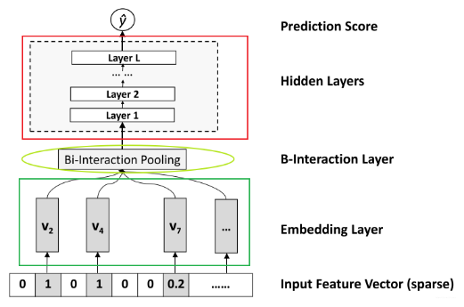

<!-- @import "[TOC]" {cmd="toc" depthFrom=1 depthTo=6 orderedList=false} -->

<!-- code_chunk_output -->

- [1. 动机](#1-动机)
- [2. 模型结构与原理](#2-模型结构与原理)
  - [2.1 Input和Embedding层](#21-input和embedding层)
  - [2.2 Bi-Interaction Pooling layer](#22-bi-interaction-pooling-layer)
  - [2.3 隐藏层](#23-隐藏层)
  - [2.4 预测层](#24-预测层)
- [3. 代码实现](#3-代码实现)

<!-- /code_chunk_output -->

### 1. 动机
NFM(Neural Factorization Machines)是2017年由新加坡国立大学的何向南教授等人在SIGIR会议上提出的一个模型，传统的FM模型仅局限于线性表达和二阶交互， 无法胜任生活中各种具有复杂结构和规律性的真实数据， 针对FM的这点不足， 作者提出了一种将FM融合进DNN的策略，通过引进了一个特征交叉池化层的结构，使得FM与DNN进行了完美衔接，这样就组合了FM的建模低阶特征交互能力和DNN学习高阶特征交互和非线性的能力，形成了深度学习时代的神经FM模型(NFM)。
<!--more-->
那么NFM具体是怎么做的呢？ 首先看一下NFM的公式： $$ \hat{y}_{N F M}(\mathbf{x})=w{0}+\sum_{i=1}^{n} w_{i} x_{i}+f(\mathbf{x}) $$ 我们对比FM， 就会发现变化的是第三项，前两项还是原来的， 因为我们说FM的一个问题，就是只能到二阶交叉， 且是线性模型， 这是他本身的一个局限性， 而如果想突破这个局限性， 就需要从他的公式本身下点功夫， 于是乎，作者在这里改进的思路就是用一个表达能力更强的函数来替代原FM中二阶隐向量内积的部分。


而这个表达能力更强的函数呢， 我们很容易就可以想到神经网络来充当，因为神经网络理论上可以拟合任何复杂能力的函数， 所以作者真的就把这个$f(x)$换成了一个神经网络，当然不是一个简单的DNN， 而是依然底层考虑了交叉，然后高层使用的DNN网络， 这个也就是我们最终的NFM网络了：


### 2. 模型结构与原理
#### 2.1 Input和Embedding层
输入层的特征， 文章指定了稀疏离散特征居多， 这种特征我们也知道一般是先one-hot, 然后会通过embedding，处理成稠密低维的。 所以这两层还是和之前一样，假设$\mathbf{v}_{\mathbf{i}} \in \mathbb{R}^{k}$为第$i$个特征的embedding向量， 那么$\mathcal{V}{x}={x_{1} \mathbf{v}_{1}, \ldots, x_{n} \mathbf{v}_{n}}$表示的下一层的输入特征。这里带上了$x_i$是因为很多$x_i$转成了One-hot之后，出现很多为0的， 这里的${x_iv_i}$是$x_i$不等于0的那些特征向量。

#### 2.2 Bi-Interaction Pooling layer
在Embedding层和神经网络之间加入了特征交叉池化层是本网络的核心创新了，正是因为这个结构，实现了FM与DNN的无缝连接， 组成了一个大的网络，且能够正常的反向传播。假设$\mathcal{V}_{x}$是所有特征embedding的集合， 那么在特征交叉池化层的操作：

$$ f_{B I}\left(\mathcal{V}{x}\right)=\sum_{i=1}^{n} \sum_{j=i+1}^{n} x_{i} \mathbf{v}_{i} \odot x_{j} \mathbf{v}_{j} $$

$\odot$表示两个向量的元素积操作，即两个向量对应维度相乘得到的元素积向量（可不是点乘呀），其中第$k$维的操作： $$ \left(v_{i} \odot v_{j}\right)_{k}=\boldsymbol{v}_{i k} \boldsymbol{v}_{j k} $$

这便定义了在embedding空间特征的二阶交互，这个不仔细看会和感觉FM的最后一项很像，但是不一样，一定要注意这个地方不是两个隐向量的内积，而是元素积，也就是这一个交叉完了之后k个维度不求和，最后会得到一个$k$维向量，而FM那里内积的话最后得到一个数， 在进行两两Embedding元素积之后，对交叉特征向量取和， 得到该层的输出向量， 很显然， 输出是一个$k$维的向量。

注意， 之前的FM到这里其实就完事了， 上面就是输出了，而这里很大的一点改进就是加入特征池化层之后， 把二阶交互的信息合并， 且上面接了一个DNN网络， 这样就能够增强FM的表达能力了， 因为FM只能到二阶， 而这里的DNN可以进行多阶且非线性，只要FM把二阶的学习好了， DNN这块学习来会更加容易， 作者在论文中也说明了这一点，且通过后面的实验证实了这个观点。

如果不加DNN， NFM就退化成了FM，所以改进的关键就在于加了一个这样的层，组合了一下二阶交叉的信息，然后又给了DNN进行高阶交叉的学习，成了一种“加强版”的FM。

Bi-Interaction层不需要额外的模型学习参数，更重要的是它在一个线性的时间内完成计算，和FM一致的，即时间复杂度为$O\left(k N_{x}\right)$，$N_x$为embedding向量的数量。参考FM，可以将上式转化为： $$ f_{B I}\left(\mathcal{V}{x}\right)=\frac{1}{2}\left[\left(\sum_{i=1}^{n} x_{i} \mathbf{v}{i}\right)^{2}-\sum_{i=1}^{n}\left(x_{i} \mathbf{v}_{i}\right)^{2}\right] $$ 后面代码复现NFM就是用的这个公式直接计算，比较简便且清晰。

#### 2.3 隐藏层
这一层就是全连接的神经网络， DNN在进行特征的高层非线性交互上有着天然的学习优势，公式如下： $$ \begin{aligned} \mathbf{z}_{1}=&\sigma_{1}\left(\mathbf{W}_{1} f_{B I} \left(\mathcal{V}{x}\right)+\mathbf{b}_{1}\right) \\
\mathbf{z}_{2}
=& \sigma_{2}\left(\mathbf{W}_{2} \mathbf{z}{1}+\mathbf{b}_{2}\right) 
\ \ldots \ldots \\
 \mathbf{z}_{L}
=& \sigma_{L}\left(\mathbf{W}_{L} \mathbf{z}_{L-1}+\mathbf{b}_{L}\right) \end{aligned} $$ 这里的$\sigma_i$是第$i$层的激活函数，可不要理解成sigmoid激活函数。

#### 2.4 预测层
这个就是最后一层的结果直接过一个隐藏层，但注意由于这里是回归问题，没有加sigmoid激活： $$ f(\mathbf{x})=\mathbf{h}^{T} \mathbf{z}_{L} $$

所以， NFM模型的前向传播过程总结如下： $$ \begin{aligned} \hat{y}_{N F M}(\mathbf{x}) &=w{0}+\sum_{i=1}^{n} w_{i} x_{i} \ &+\mathbf{h}^{T} \sigma_{L}\left(\mathbf{W}_{L}\left(\ldots \sigma_{1}\left(\mathbf{W}_{1} f_{B I}\left(\mathcal{V}{x}\right)+\mathbf{b}_{1}\right) \ldots\right)+\mathbf{b}_{L}\right) \end{aligned} $$ 这就是NFM模型的全貌， NFM相比较于其他模型的核心创新点是特征交叉池化层，基于它，实现了FM和DNN的无缝连接，使得DNN可以在底层就学习到包含更多信息的组合特征，这时候，就会减少DNN的很多负担，只需要很少的隐藏层就可以学习到高阶特征信息。NFM相比之前的DNN， 模型结构更浅，更简单，但是性能更好，训练和调参更容易。集合FM二阶交叉线性和DNN高阶交叉非线性的优势，非常适合处理稀疏数据的场景任务。在对NFM的真实训练过程中，也会用到像Dropout和BatchNormalization这样的技术来缓解过拟合和在过大的改变数据分布。

### 3. 代码实现
下面我们看下NFM的代码复现，这里主要是给大家说一下这个模型的设计逻辑，参考了deepctr的函数API的编程风格， 具体的代码以及示例大家可以去参考后面的GitHub，里面已经给出了详细的注释， 这里主要分析模型的逻辑这块。关于函数API的编程式风格，我们还给出了一份文档， 大家可以先看这个，再看后面的代码部分，会更加舒服些。下面开始：

这里主要说一下NFM模型的总体运行逻辑， 这样可以让大家从宏观的层面去把握模型的设计过程， 该模型所使用的数据集是criteo数据集，具体介绍参考后面的GitHub。 数据集的特征会分为dense特征(连续)和sparse特征(离散)， 所有模型的输入层接收这两种输入。但是我们这里把输入分成了linear input和dnn input两种情况，而每种情况都有可能包含上面这两种输入。因为我们后面的模型逻辑会分这两部分走，这里有个细节要注意，就是光看上面那个NFM模型的话，是没有看到它线性特征处理的那部分的，也就是FM的前半部分公式那里图里面是没有的。但是这里我们要加上。 $$ \hat{y}_{N F M}(\mathbf{x})=w_{0}+\sum_{i=1}^{n} w_{i} x_{i}+f(\mathbf{x}) $$ 所以模型的逻辑我们分成了两大部分，这里我分别给大家解释下每一块做了什么事情：

1. linear part: 这部分是有关于线性计算，也就是FM的前半部分$w_1x_1+w_2x_2...w_nx_n+b$的计算。对于这一块的计算，我们用了一个get_linear_logits函数实现，后面再说，总之通过这个函数，我们就可以实现上面这个公式的计算过程，得到linear的输出
2. dnn part: 这部分是后面交叉特征的那部分计算，FM的最后那部分公式f(x)。 这一块主要是针对离散的特征，首先过embedding， 然后过特征交叉池化层，这个计算我们用了get_bi_interaction_pooling_output函数实现， 得到输出之后又过了DNN网络，最后得到dnn的输出
模型的最后输出结果，就是把这两个部分的输出结果加和(当然也可以加权)，再过一个sigmoid得到。所以NFM的模型定义就出来了：
```
def NFM(linear_feature_columns, dnn_feature_columns):
    """
    搭建NFM模型，上面已经把所有组块都写好了，这里拼起来就好
    :param linear_feature_columns: A list. 里面的每个元素是namedtuple(元组的一种扩展类型，同时支持序号和属性名访问组件)类型，表示的是linear数据的特征封装版
    :param dnn_feature_columns: A list. 里面的每个元素是namedtuple(元组的一种扩展类型，同时支持序号和属性名访问组件)类型，表示的是DNN数据的特征封装版
    """
    # 构建输入层，即所有特征对应的Input()层， 这里使用字典的形式返回， 方便后续构建模型
    # 构建模型的输入层，模型的输入层不能是字典的形式，应该将字典的形式转换成列表的形式
    # 注意：这里实际的输入与Input()层的对应，是通过模型输入时候的字典数据的key与对应name的Input层
    dense_input_dict, sparse_input_dict = build_input_layers(linear_feature_columns+dnn_feature_columns)
    input_layers = list(dense_input_dict.values()) + list(sparse_input_dict.values())
    
    # 线性部分的计算 w1x1 + w2x2 + ..wnxn + b部分，dense特征和sparse两部分的计算结果组成，具体看上面细节
    linear_logits = get_linear_logits(dense_input_dict, sparse_input_dict, linear_feature_columns)
    
    # DNN部分的计算
    # 首先，在这里构建DNN部分的embedding层，之所以写在这里，是为了灵活的迁移到其他网络上，这里用字典的形式返回
    # embedding层用于构建FM交叉部分以及DNN的输入部分
    embedding_layers = build_embedding_layers(dnn_feature_columns, sparse_input_dict, is_linear=False)
    
    # 过特征交叉池化层
    pooling_output = get_bi_interaction_pooling_output(sparse_input_dict, dnn_feature_columns, embedding_layers)
    
    # 加个BatchNormalization
    pooling_output = BatchNormalization()(pooling_output)
    
    # dnn部分的计算
    dnn_logits = get_dnn_logits(pooling_output)
    
    # 线性部分和dnn部分的结果相加，最后再过个sigmoid
    output_logits = Add()([linear_logits, dnn_logits])
    output_layers = Activation("sigmoid")(output_logits)
    
    model = Model(inputs=input_layers, outputs=output_layers)
    
    return model

```