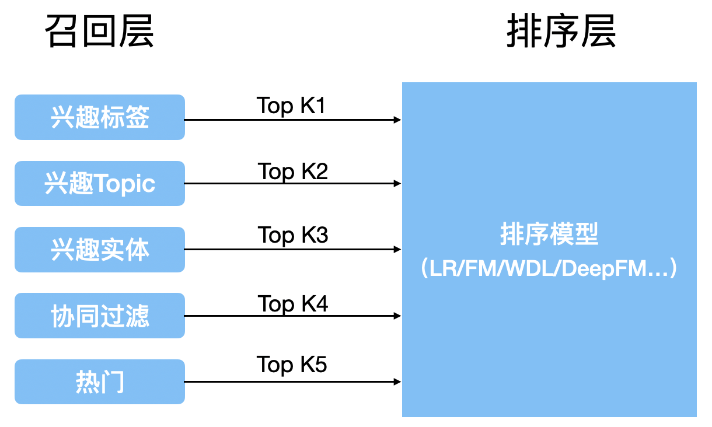
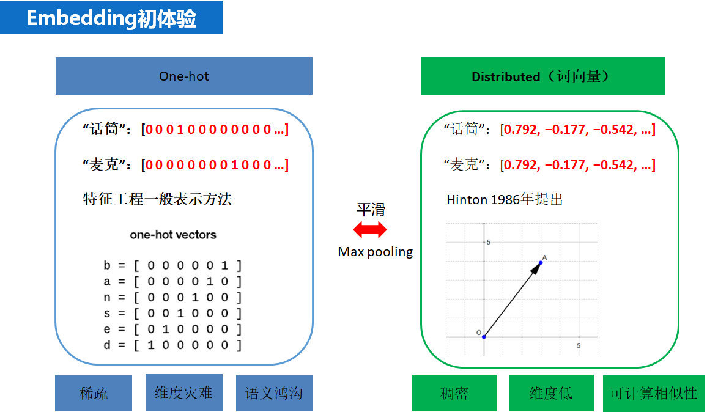

<!--more-->
# 推荐系统简介
1. 做什么
    - 用户：帮助用户快速发现有用信息
    - 企业：增加产品与潜在用户接触、购买等行为概率的工具
2. 为什么
    - 用户：在需求不明确的时候进行信息过滤，利用用户的各类历史信息猜测其可能喜欢的内容
    - 使产品最大限度的吸引用户，留存客户，增长用户黏性，提高用户转化率
3. 为了谁
   - 用户和企业，在此基础上，展开想想什么样的人需要推荐系统，及什么样的企业需要推荐系统

# 评价指标
1. 用户满意度
    &emsp;&emsp;用户满意度直接决定推荐系统的好坏，但是无法离线计算。因此需要购买率来度量客户满意度，与此类似的还有用户停留时间和转化率等指标。

2. 预测精准度
    预测准确度是用来度量用户的实际行为与推荐系统预测结果的准确度，是最重要的离线评价指标。
    - 评分预测
        预测用户对物品的评分行为称为评分预测。评分预测模型通过对用户的历史物品评分记录进行建模，进而得到用户的兴趣模型，然后使用模型预测用户对未见过商品的评分。评分预测的准确度一般通过均方根误差（RMSE）或者平均绝对误差（MAE）计算。对于测试集中的一个用户$u$和物品$i$,令$r_{ui}$是用户$u$对物品$i$的实际评分,而$\hat{r_{ui}}$是推荐模型预测出的评分,那么RMSE可以定义为: $$ RMSE = \sqrt{\frac{\sum_{u,i \in T}(r_{ui} - \hat{r}_{ui})^2}{|T|}} $$ MAE定义为: $$ MAE = \frac{\sum{u,i \in T}|r_{ui} - \hat{r}_{ui}|}{|T|} $$ RMSE由于存在平方项，使得使得用户真实评分与推荐系统预测评分相差较大的用户加大了惩罚，即该评测指标对系统要求更加的苛刻
    - TopN推荐
         推荐系统在给用户推荐物品的时候,往往会给用户一个列表的推荐物品,这种场景下的推荐成为是TopN推荐,该推荐方式最常用的预测准确率指标一般是精确率(precision)和召回率(recall),令$R(u)$为通过推荐模型得到的推荐列表,$T(u)$为用户在实际场景中(测试集)的行为列表.

        + 精确率(precision): 分类正确的正样本个数占分类器判定为正样本的样本个数比例(这里$R(u)$相当于是模型判定的正样本) $$ Precision= \frac{\sum_{u \in U}|R(u) \cap T(u)|}{\sum_{u \in U}|R(u)|} $$

        + 召回率(recall): 分类正确的正样本个数占真正的正样本个数的比例(这里的$T(u)$相当于真正的正样本集合)

            $$ Recall= \frac{\sum_{u \in U}|R(u) \cap T(u)|}{\sum_{u \in U}|T(u)|} $$
    有时候为了更加全面的评估TopN推荐,通常会选取不同的推荐列表长度计算多组精确率与召回率然后分别绘制出精确率曲线和召回率曲线,需要注意的是这里并不是PR曲线,感兴趣的可以了解一下PR曲线相关的知识.

3. 覆盖率
    覆盖率是用来描述一个推荐系统对物品长尾的发掘能力,一个简单的定义可以是:推荐系统所有推荐出来的商品集合数占总物品集合数的比例.
    信息熵定义覆盖率: 其中$p(i)$是物品$i$的流行度除以所有物品流行度之和 $$ H = -\sum_{i=1}^n p(i) logp(i) $$ 基尼系数定义覆盖率: 其中$i_j$是按照物品流行度p从小到大排序的物品列表中第$j$个物品 $$ G=\frac{1}{n-1} \sum_{j=1}^{n}(2j-n-1)p(i_{j}) $$

4. 多样性
    人的兴趣爱好通常是比较广泛的,所以一个好的推荐系统得到的推荐列表中应该尽可能多的包含用户的兴趣,只有这样才能增加用户找到感兴趣物品的概率.度量推荐列表中物品的多样性换句话说就是度量推荐列表中所有物品之间的不相似性,可以通过不同的相似性函数来度量推荐列表中商品的相似性,比如商品基于内容的相似,基于协同过滤的相似,这样就可以得到不同角度的多样性.令函数$s(i,j)$为物品$i$和物品$j$的相似性,那么用户推荐列表的多样性可以定义为: $$ Diversity(R(u))=1-\frac{\sum_{i,j \in R(u)}s(i,j)}{\frac{1}{2}|R(u)|(|R(u)|-1)} $$ 推荐系统整体的多样性可以定义为所有用户推荐列表多样性的平均值: $$ Diversity = \frac{1}{U} \sum_{u\in U}Diversity(R(u)) $$

5. 新颖性
    满足推荐的新颖性最简单的方法就是给用户推荐他们之前没有看过的物品,但是每个用户没见过的物品数量是非常庞大的,所以一般会计算推荐物品的平均流行度,流行度越低的物品越有可能让用户觉得新颖,因此,如果推荐结果中的物品平均热门程度比较低说明推荐的结果就可能比较新颖.

6. AUC曲线
    AUC（Area Under Curve），ROC曲线下与坐标轴围成的面积
    TP：真的真了（真实值是真的，预测也是真）
    FN：真的假了（真实值是真的，预测为假了）
    FP：假的真了（真实值是假的，预测为真了）
    TN：假的假了（真实值是假的，预测也是假）
     $$ Recall = \frac{TP}{TP+FN}\ Precise=\frac{TP}{TP+FP} $$ ROC(Receiver Operating Characteristic Curve)曲线：
     
     ROC曲线的横坐标为假阳性率（False Positive Rate, FPR），N是真实负样本的个数， FP是N个负样本中被分类器预测为正样本的个数。

    纵坐标为真阳性率（True Positive Rate, TPR），P是真实正样本的个数，TP是P个正样本中被分类器预测为正样本的个数。

# 召回
1. 召回层在推荐系统架构中的位置及作用

    &nbsp;
    在推荐系统架构中召回层与排序层是推荐系统的核心算法层，而将推荐过程分成召回层与排序层主要是基于工程上的考虑，其中召回阶段负责将海量的候选集快速缩小为几万到几千的规模；而排序层则负责对缩小后的候选集进行精准排序。所以在召回阶段往往会利用少量的特征和简单的模型对大规模的数据集进行快速的筛选，而在排序层一般会使用更多的特征和更加复杂的模型进行精准的排序。
    &nbsp;
    **下面是召回层与排序层的特点**
    + **召回层**:待计算的候选集合大、计算速度快、模型简单、特征较少，尽量让用户感兴趣的物品在这个阶段能够被快速召回，即保证相关物品的召回率
    + **排序层**:首要目标是得到精准的排序结果。需要处理的物品数量少，可以利用较多的特征，使用比较复杂的模型。
  
在设计召回层时，“计算速度”和“召回率”其实是矛盾的两个指标，为提高“计算速度”，需要使召回策略尽量简单一些；而为了提高“召回率”，要求召回策略尽量选出排序模型所需要的候选集，这也就要求召回策略不能过于简单。在权衡计算速度和召回率后，目前工业界主流的召回方法是采用多个简单策略叠加的“多路召回策略”

2. 多路召回策略
   所谓的“多路召回”策略，就是指采用不同的策略、特征或简单模型，分别召回一部分候选集，然后把候选集混合在一起供后续排序模型使用，可以明显的看出，“多路召回策略”是在“计算速度”和“召回率”之间进行权衡的结果。其中，各种简单策略保证候选集的快速召回，从不同角度设计的策略保证召回率接近理想的状态，不至于损伤排序效果。
   
   具体使用哪些召回策略其实是与业务强相关的，针对不同的任务就会有对于该业务真实场景下需要考虑的召回规则。例如视频推荐，召回规则可以是“热门视频”、“导演召回”、“演员召回”、“最近上映“、”流行趋势“、”类型召回“等等。
   &nbsp;
   **多路召回存在的问题**
   &nbsp;
   虽然多路召回权衡了计算速度和召回率的问题，可以使得用于排序的候选商品更加的丰富，但是实际的多路召回仍然存在一些问题。如上图所示，对于每一路召回都会从商品集合中拉回K个商品，这里的K是一个超参数，对于K的选择一般需要通过离线评估加线上的A/B测试来确定合理的K值。除此之外，对于不同的任务具体策略的选择也是人工基于经验的选择，选择的策略之间的信息是割裂的，无法总和考虑不同策略对一个物品的影响。

3. Embedding召回

 

**embedding 是什么**

Embedding其实是一种思想，主要目的是将稀疏的向量(如one-hot编码)表示转换成稠密的向量，下图直观的显示了one-hot编码和Embedding表示的区别于联系，即Embedding相当于是对one-hot做了平滑，而onehot相当于是对Embedding做了max pooling。

**常见的Embedding技术有哪些？**

目前主要三大类：
+ text embedding
+ image embedding
+ graph embedding

在推荐系统领域，text embedding技术是目前使用最多的embedding技术，对于文本特征可以直接使用该技术，对于非文本的id类特征，可以先将其转化成id序列再使用text embedding的技术获取id的embedding再做召回。

常见的text Embedding的技术有：

+ 静态向量：word2vec, fasttext, glove
+ 动态向量：ELMO, GPT, BERT

对于image embedding其实主要是对于有图或者视频的特征，目前计算机视觉模型已经发展的比较成熟了，对于图像与视频的识别都有效果比较好的模型，大部分都是卷积模块通过各种连接技巧搭建的高效模型，可以使用现有的预训练模型提取图像或者视频的向量特征，然后用于召回。

对于社交网络相关的推荐，进行推荐的用户与用于之间或者商品之间天然的存在某种复杂的图结构的关系，如何利用图中节点与节点之间的关系对其进行向量化是非常关键的，在这种场景下基于序列的text embedding和基于卷积模型的image embedding都显得力不从心，在这样的背景下Graph Embedding逐渐在推荐系统中流行起来。经典的Graph Embedding模型有, Deep Walk, Node2Vec，LINE以及比较新的阿里巴巴2018年公布的EGES graph Embedding模型。

4. 参考文献：
+ [推荐系统 embedding 技术实践总结](https://zhuanlan.zhihu.com/p/143763320)
+ [推荐系统召回策略之多路召回与Embedding召回](https://blog.csdn.net/luanfenlian0992/article/details/107416438)