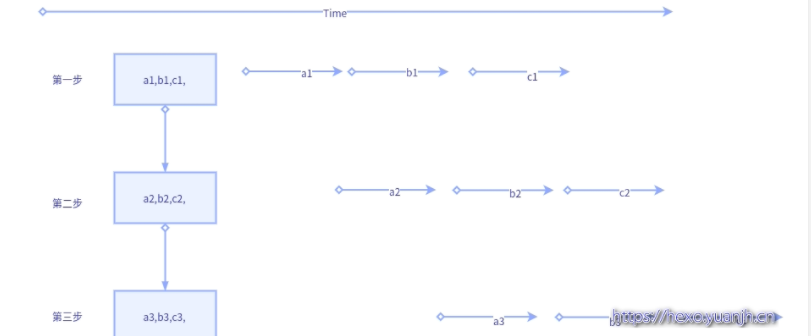

# 偏函数

定义：偏函数的第二个部分(可变参数)，按原有函数的参数顺序进行补充，参数将作用在原函数上，最后偏函数返回一个新函数（类似于，装饰器decorator，对于函数进行二次包装，产生特殊效果；但又不同于装饰器，偏函数产生了一个新函数，而装饰器，可改变被装饰函数的函数入口地址也可以不影响原函数）

例一：

```
from functools import partial
 
def mod( n, m ):
  return n % m
 
mod_by_100 = partial( mod, 100 )
 
print mod( 100, 7 )  # 2
print mod_by_100( 7 )  # 2
```

例二：

```
from functools import partial
 
bin2dec = partial( int, base=2 )
print bin2dec( '0b10001' )  # 17
print bin2dec( '10001' )  # 17
 
hex2dec = partial( int, base=16 )
print hex2dec( '0x67' )  # 103
print hex2dec( '67' )  # 103
```

<!--more-->

# 同步，异步，阻塞，非阻塞

二者其实是不同维度的东西，但是的确容易搞混。

做法A(同步，阻塞) :开单独线程（进程）处理，线程内一般是循环接收消息。
做法B(同步，非阻塞) :主线程循环处理,但一般搭配sleep函数(释放时间片,自身状态运行转就绪再等待时间片)，避免完全的cpu空转
做法C(异步，非阻塞):函数参数包含函数(回调函数)，或url地址，类似的东西，对方有消息就推送给你，所以还需要新开一个接口(or功能)用来接受信息。

例子：

```
例子:老张水壶
老张爱喝茶，废话不说，煮开水。
出场人物：老张，水壶两把（普通水壶，简称水壶；会响的水壶，简称响水壶）。
1 老张把水壶放到火上，立等水开。（同步阻塞）
2 老张把水壶放到火上，去客厅看电视，时不时去厨房看看水开没有。（同步非阻塞）
老张还是觉得自己有点傻，于是变高端了，买了把会响笛的那种水壶。水开之后，能大声发出嘀~的噪音。
3 老张把响水壶放到火上，立等水开。（异步阻塞）
4 老张把响水壶放到火上，去客厅看电视，水壶响之前不再去看它了，响了再去拿壶。（异步非阻塞）
所谓同步异步，只是对于水壶而言。
普通水壶，同步；响水壶，异步。虽然都能干活，但响水壶可以在自己完工之后，提示老张水开了。这是普通水壶所不能及的。同步只能让调用者去轮询自己（情况2中），造成老张效率的低下。
所谓阻塞非阻塞，仅仅对于老张而言。
立等的老张，阻塞；看电视的老张，非阻塞。情况1和情况3中老张就是阻塞的，媳妇喊他都不知道。虽然3中响水壶是异步的，可对于立等的老张没有太大的意义。所以一般异步是配合非阻塞使用的，这样才能发挥异步的效用。
```


# 并发

## 进程状态和调度


## 进程,线程,协程


1、进程
进程是具有一定独立功能的程序关于某个数据集合上的一次运行活动,进程是系统进行**资源**分配和调度的一个独立单位。每个进程都有自己的独立内存空间，不同进程通过进程间通信来通信。由于进程比较重量，占据独立的内存，所以上下文进程间的切换开销（栈、寄存器、虚拟内存、文件句柄等）比较大，但相对比较稳定安全。
2、线程
线程是进程的一个实体,是**CPU调度**和分派的基本单位,它是比进程更小的能独立运行的基本单位.线程自己基本上不拥有系统资源,只拥有一点在运行中必不可少的资源(如程序计数器,一组寄存器和栈),但是它可与同属一个进程的其他的线程共享进程所拥有的全部资源。线程间通信主要通过共享内存，上下文切换很快，资源开销较少，但相比进程不够稳定容易丢失数据。
3、协程
协程是一种**用户态的轻量级线程**，协程的调度完全由用户控制。协程拥有自己的寄存器上下文和栈。协程调度切换时，将寄存器上下文和栈保存到其他地方，在切回来的时候，恢复先前保存的寄存器上下文和栈，直接操作栈则基本没有内核切换的开销，**可以不加锁的访问全局变量**，所以上下文的切换非常快。

## 多进程和多线程

在数据共享、同步方面，多进程是数据共享复杂，需要用IPC，数据是分开的，同步简单。多线程因为共享进程数据，数据共享简单，但同步复杂；
在内存、CPU方面，多进程占用内存多，切换复杂，CPU利用率低。
多线程占用内存少，切换简单，CPU利用率高；
在创建销毁、切换方面，多进程创建销毁、切换复杂，速度慢。多线程创建销毁、切换简单，速度很快；
在编程、调试方面，**多进程编程和调试都简单。多线程编程和调试都复杂**；
**可靠性方面，多进程间不会互相影响。多线程中的一个线程挂掉将导致整个进程挂掉；**
在分布式方面，多进程适应于多核、多机分布式。多线程适应于多核分布式。

**多进程模式最大的优点就是稳定性高**，因为一个子进程崩溃了，不会影响主进程和其他子进程。（当然主进程挂了所有进程就全挂了，但是Master进程只负责分配任务，挂掉的概率低）著名的Apache最早就是采用多进程模式。
**多进程模式的缺点是创建进程的代价大**，在Unix/Linux系统下，用fork调用还行，在Windows下创建进程开销巨大。另外，操作系统能同时运行的进程数也是有限的，在内存和CPU的限制下，如果有几千个进程同时运行，操作系统连调度都会成问题。
多线程模式通常比多进程快一点，但是也快不到哪去，而且，**多线程模式致命的缺点**就是任何一个线程挂掉都可能直接造成**整个进程崩溃**，因为所有线程共享进程的内存。在Windows上，如果一个线程执行的代码出了问题，你经常可以看到这样的提示：“该程序执行了非法操作，即将关闭”，其实往往是某个线程出了问题，但是操作系统会强制结束整个进程。
**在Windows下，多线程的效率比多进程要高**，所以微软的IIS服务器默认采用多线程模式。由于多线程存在稳定性的问题，IIS的稳定性就不如Apache。为了缓解这个问题，IIS和Apache现在又有多进程+多线程的混合模式，真是把问题越搞越复杂。


## 线程和协程

协程:又被称为用户级线程或绿色线程。

1) 一个线程可以多个协程，一个进程也可以单独拥有多个协程，这样python中则能使用多核CPU。
2)  线程进程都是同步机制，而协程则是异步
3) 协程能保留上一次调用时的状态，每次过程重入时，就相当于进入上一次调用的状态


## 协程

协程 :
能够在一个线程中实现并发效果的效果,提高cpu的利用率
无需原子操作锁定及同步的开销
能够规避一些任务中的IO操作
方便切换控制流，简化编程模型
协程相比于多线程的优势 切换的效率更快了

缺点：
无法利用多核资源：协程的本质是个单线程,它不能同时将 单个CPU 的多个核用上,协程需要和进程配合才能运行在多CPU上.当然我们日常所编写的绝大部分应用都没有这个必要，除非是cpu密集型应用。

线程和进程的操作是由程序触发系统接口，最后的执行者是系统，它本质上是操作系统提供的功能。而协程的操作则是程序员指定的，在python中通过yield，人为的实现并发处理。
协程存在的意义：对于多线程应用，CPU通过切片的方式来切换线程间的执行，线程切换时需要耗时。协程，则只使用一个线程，分解一个线程成为多个“微线程”，在一个线程中规定某个代码块的执行顺序。
协程的适用场景：当程序中存在大量不需要CPU的操作时（IO）。
常用第三方模块gevent和greenlet。（本质上，gevent是对greenlet的高级封装，因此一般用它就行，这是一个相当高效的模块。）


# 何时使用多进程or多线程

使用多进程or线程,对于python，考虑到GIL锁，基本上**默认使用多进程**就对了。
除此之外，线程**共享全局变量**，进程**全局变量则是隔离的**，实际进程大多数情况需要通信的，所以也需要考虑共享数据读写问题处理。 决定因素稳定性和数据共享要求上（操作系统差异性，win偏好线程，linux偏好进程）
性能上虽然线程较好，但实际除了大型互联网公司和部分专业性质软件，大多数中小型公司的并发量，并不会带来很大影响，况且目前服务器领域，基本上LInux和Unix占比较高，线程相比进程在性能上优势并不十分突出。所以这方面考量不会太大的。


## 线程是并发还是并行，进程是并发还是并行？

**线程是并发**，**进程是并行**；
现代os都将**线程作为最小调度单位**，进程作为**资源分配的最小单位**。


## 父子进程如何区分?

 子进程是父进程通过fork()产生出来的，pid = os.fork()
​ 通过**返回值pid是否为0**，判断是否为子进程，如果是0，则表示是子进程
​ 由于 fork() 是 Linux 上的概念，所以如果要跨平台，最好还是使用 subprocess 模块来创建子进程。


## 子进程如何回收？

python中采用os.wait()方法用来回收子进程占用的资源
pid, result = os.wait() # 回收子进程资源　阻塞，等待子进程执行完成回收
如果有子进程没有被回收的，但是父进程已经死掉了，这个子进程就是僵尸进程。孤儿进程,父类进程over.,子进程未结束


|             | Multi-args | Concurrence | Blocking | Ordered-results |
| :---------- | :--------- | :---------- | :------- | --------------- |
| map         | no         | yes         | yes      | yes             |
| apply       | yes        | no          | yes      | no              |
| map_async   | no         | yes         | no       | yes             |
| apply_async | yes        | yes         | no       | no              |

需要注意：map 和 map_async 入参为迭代器类型，可以批量调用。而apply和apply_async只能一个个调用。且进程池只能传递管道，而不能用队列。

```
# map
results = pool.map(worker, [1, 2, 3])

# apply
for x, y in [[1, 1], [2, 2]]:
    results.append(pool.apply(worker, (x, y)))

def collect_result(result):
    results.append(result)

# map_async
pool.map_async(worker, jobs, callback=collect_result)

# apply_async
for x, y in [[1, 1], [2, 2]]:
    pool.apply_async(worker, (x, y), callback=collect_result)
```


# 生产者消费者模式

这也是实际项目中使用较多的一种并发模式，用Queue(JoinableQueue)实现，是Python中最常用的方式(这里的queue特指multiprocess包下的queue，非queue.Queue)。

## queue

```
# encoding:utf-8
__author__ = 'Fioman'
__time__ = '2019/3/7 14:06'
from multiprocessing import Process,Queue
import time,random

def consumer(q,name):
    while True:
        food = q.get()
        if food is None:
            print('接收到了一个空,生产者已经完事了')
            break

        print('\033[31m{}消费了{}\033[0m'.format(name,food))
        time.sleep(random.random())

def producer(name,food,q):
    for i in range(10):
        time.sleep(random.random())
        f = '{}生产了{}{}'.format(name,food,i)
        print(f)
        q.put(f)


if __name__ == '__main__':
    q = Queue(20)
    p1 = Process(target=producer,args=('fioman','包子',q))
    p2 = Process(target=producer,args=('jingjing','馒头',q))
    p1.start()
    p2.start()

    c1 = Process(target=consumer,args=(q,'mengmeng'))
    c2 = Process(target=consumer,args=(q,'xiaoxiao'))
    c1.start()
    c2.start()

    # 让主程序可以等待子进程的结束.
    p1.join()
    p2.join()
    # 生产者的进程结束,这里需要放置两个空值,供消费者获取,用来判断已经没有存货了
    q.put(None)
    q.put(None)

    print('主程序结束..........')
```

## JoinableQueue

创建可连接的共享进程队列,它们也是队列,但是这些队列比较特殊.它们可以允许消费者通知生产者项目已经被成功处理.注意,这里必须是生产者生产完了,生产者的进程被挂起,等到消费者完全消费的时候,生产者进程就结束,然后主程序结束.将消费者进程设置为守护进程,这样的话,主进程结束的时候,消费进程也就结束了.

```
q.task_done() 
使用者使用此方法发出信号，表示q.get()返回的项目已经被处理。如果调用此方法的次数大于从队列中删除的项目数量，将引发ValueError异常。

q.join() 
生产者将使用此方法进行阻塞，直到队列中所有项目均被处理。阻塞将持续到为队列中的每个项目均调用q.task_done()方法为止。 
# encoding:utf-8
__author__ = 'Fioman'
__time__ = '2019/3/7 14:06'
from multiprocessing import Process,JoinableQueue
import time,random

def consumer(q,name):
    while True:
        food = q.get()
        if food is None:
            print('接收到了一个空,生产者已经完事了')
            break

        print('\033[31m{}消费了{}\033[0m'.format(name,food))
        time.sleep(random.random())
        q.task_done()  # 向生产者发送信号,表示消费了一个

def producer(name,food,q):
    for i in range(10):
        time.sleep(random.random())
        f = '{}生产了{}{}'.format(name,food,i)
        print(f)
        q.put(f)
    q.join() # 当生产者生产完毕之后,会在这里阻塞.等待消费者的消费.


if __name__ == '__main__':
    q = JoinableQueue(20)
    p1 = Process(target=producer,args=('fioman','包子',q))
    p2 = Process(target=producer,args=('jingjing','馒头',q))
    p1.start()
    p2.start()

    c1 = Process(target=consumer,args=(q,'mengmeng'))
    c2 = Process(target=consumer,args=(q,'xiaoxiao'))
    c1.daemon = True # 将消费者设置为守护进程
    c2.daemon = True # 将消费者设置为守护进程
    c1.start()
    c2.start()

    # 让主程序可以等待生产子进程的结束.
    p1.join()
    p2.join()


    print('主程序结束..........')
```

在消费者调用q.task_done()时，会触发一次q.join()的检查(q.join()是用来阻塞进程的，最后一个任务完成后，q.task_done()＝》q.join()＝》阻塞解除)，之后生产者进程退出。而消费者呢？业务逻辑层面上是没有退出的（本例）。比如，本例中通过**设置为守护进程的方式进行退出**。但如果后续主进程还有其他任务，而没有退出呢？那么这些子进程则沦为僵尸进程，虽然对系统资源消耗很少(消费者的queue.get()也是阻塞的，所以不会执行循环，仅仅会“卡”在那里，但也不会自动消亡)，但感觉非常别扭的。所以个人还是倾向于用”生产者queue.put(None) ,消费者见到None则break(退出循环)”的传统方式 进行消费者进程触发退出。如果采用这种方式那么JoinableQueue相比Queue就没有优势了。

假如有一种队列，内置了**状态信息(存活生产者个数)**，设置目前存活的生产者个数
StatusableQueue(product_n=2,size=20)　#product_n=2含义：存活的生产者个数,size=20,队列长度
生产者：生产结束，q.product_n - 1(存活生产者个数-1)
消费者：存活生产者个数=0(生产者均已经完成生成) 且 队列长度=0(队列也已经消费结束) 则退出消费者进程.
这种情况下，只需要　消费者.join()　就可以保证整个生产消费进程的执行结束(这一点和JoinableQueue很像，不过JoinableQueue是 生产者.join())
一共只改动3处，就可以完成生产者消费者的并行化控制。 而且更符合逻辑，因为生产者是明确知道自己的退出条件的，而消费者依赖生产者，所以只需要观察消费者就可以知道（生成者是否结束）整个－生成消费链是否完成。

```

def consumer(q,name):
    while not (q.product_n==0 and q.size==0):# 存活生产者=0，意味着全部结束生产，队列不会新增数据,queue.size=0说明消费完毕
        food = q.get()
        print('\033[31m{}消费了{}\033[0m'.format(name,food))
        time.sleep(random.random())

def producer(name,food,q):
    for i in range(10):
        time.sleep(random.random())
        f = '{}生产了{}{}'.format(name,food,i)
        print(f)
        q.put(f)
    q.product_n -= 1 # 当生产者生产完毕之后,q.product_n - 1(存活生产者个数-1)


if __name__ == '__main__':
    q = StatusableQueue(product_n=2,size=20)#默认状态=正常,n=2含义：生产者个数,size=20,对列长度
    p1 = Process(target=producer,args=('fioman','包子',q))
    p2 = Process(target=producer,args=('jingjing','馒头',q))
    p1.start()
    p2.start()

    c1 = Process(target=consumer,args=(q,'mengmeng'))
    c2 = Process(target=consumer,args=(q,'xiaoxiao'))
    c1.start()
    c2.start()

    # 消费者消费结束（说明生产也一定结束了），则说明整个生产－消费逻辑完成
    c1.join()
    c2.join()
```

缺点：**必须知道生产者个数**，这个数据应该不难获取，毕竟后面在创建生产者时也需要使用这个变量控制。


# 并行化改造

图示变量含义说明:
1个大step中包含3个小step,大step内部的第一步，二步，三步存在依赖关系（就是内部保持顺序执行）
a1,b1,c1,表示子任务a的第一步，b的第一步，c的第一步.同理a2,表示子任务a的第二步。

## 无并行


## 水平并行

优点：修改简单，容易排错
缺点：使用场景有限，适合批量数据，不适合流式数据
实现：pool().map(step1);pool().map(step2);pool().map(step3)


## 垂直并行

优点：修改简单，容易排错
缺点：如果中间步骤耗时过多，上游依然处于限制状态
实现：pool().apply_sync(func(step1,step2,step3))


## 生产者消费者

优点：上下游耦合小，任务粒度更细
缺点：改造稍微复杂，需考虑生产者生成结束等特殊情况的兼容，并且调试也较麻烦
实现：Queue(多进程multiprocessing,Queue,多线程queue.Queue,python大多多进程)





## 协程

协成可看做特殊单线程（意味着本质是单线程，多线程是表象），任务角度多个线程同时执行，实时角度看只有一个线程真正执行，好处是无需处理线程共享数据的加锁等情况（因为只有一个线程会执行，不存在同时修改的情况）。还有就是其**进程内部不需要操作系统调度**（进程整体肯定是操作系统调度，否则就凌驾与操作系统了），**会自行调度**，释放时间片给其他内部线程。
常规的线程一旦得到cpu时间片，会毫不犹豫执行，哪怕处于sleep状态也会占用资源。而协程则不会，其会把cpu主动出让(给自己其他线程)，等到别人”呼唤”自己时才会真正执行（比如next（自己）,gevent.sleep时间到了也算唤醒）。


## 事件

优点：如果可以不同事件自动并行化(不确定python是否已实现)，基本上生产者消费者所有优点都具备，并且，额外还有容易追溯，调试的好处.
缺点：程序架构需调整。改动最大.
实现：signal(python,django)
这个严格来说，并不属于并行范畴，但是将其放到这里，因为其和生产者消费者有共通之处，而且协程的实现底层也是基于事件模型。
生产者消费者存在很大问题，就是难以调试以及流程难以控制，由于切分粒度很细，并且不同步骤之间几乎独立，虽然可以保证整体的顺序执行以及最终任务可完成，但其上下游关系难以追溯，一旦出错也难以复现。所以个人很排斥生产者消费者这种方式。
而事件则不同，生产完成后将信息注册到事件链中，不但可以保存任务结束的result,还可以传递任务本身初始参数信息。每个事件都可以看做独立函数，即使某一个出错，也可以将事件参数作为debug锚点进行追踪。


```
def thread_multi():
    threads = list()
    for url in urls:
        threads.append(threading.Thread(target=process, args=(url,)))
    [t.start() for t in threads]
    [t.join() for t in threads]


def thread_map():
    pool = ThreadPool(max(1, cpu_count() - 1))
    results = pool.map(process, urls)
    pool.close()
    pool.join()
    print(results)


def thread_async():
    pool = ThreadPool(max(1, cpu_count() - 1))
    results = list()
    for url in urls:
        results.append(pool.apply_async(process, args=(url,)))
    pool.close()
    pool.join()
    print([result.get() for result in results])


def process_multi():
    processes = list()
    for url in urls:
        processes.append(Process(target=process, args=(url,)))
    [t.start() for t in processes]
    [t.join() for t in processes]


def process_map():
    pool = Pool(processes=max(1, cpu_count() - 1))
    results = pool.map(process, urls)
    pool.close()
    pool.join()
    print(results)


def process_async():
    pool = Pool(processes=max(1, cpu_count() - 1))
    results = list()
    for url in urls:
        results.append(pool.apply_async(process, (url,)))
    pool.close()
    pool.join()
    print([result.get() for result in results])
```


# 多线程与数据同步


python并发**首选进程**，但偶尔有场景进程无法搞定，比如有些**变量是无法序列化的**，就无法使用工具包**manager()的工具类进行共享**。如果自己实现新的共享方法，可能开发量较大，且质量难以保证。此时可考虑用线程处理，规避进程的变量共享难题，而且实际场景中,**IO大概率都是瓶颈**，所以使用线程其实也的确有些优势。个人而言，选择进程和线程较为重视的**安全性**，进程数据隔离较好，互不干扰。其次就是**公用数据占比**，如果大多数数据都需公用，那么线程也会比进程更佳，避免了进程较多的数据共享问题。

### 线程本身就有局部变量，为何还需要ThreadLocal


```
import threading
 
# 创建全局ThreadLocal对象:
local_school = threading.local()
 
def process_student():
  print 'Hello, %s (in %s)' % (local_school.student, threading.current_thread().name)
 
def process_thread(name):
  # 绑定ThreadLocal的student:
  local_school.student = name
  process_student()
 
t1 = threading.Thread(target= process_thread, args=('Alice',), name='Thread-A')
t2 = threading.Thread(target= process_thread, args=('Bob',), name='Thread-B')
t1.start()
t2.start()
t1.join()
t2.join()
```


# 参考资料

[偏函数](https://hexo.yuanjh.cn/hexo/16e1d5a)

[并发](https://hexo.yuanjh.cn/hexo/549f56e4)

[闻鸡起舞 ](https://hexo.yuanjh.cn/page/5/)

[python多进程pickle](http://luly.lamost.org/blog/python_multiprocessing.html)

[Python生产者消费者模型 ](https://www.jianshu.com/p/2d3e6a21f6fe)

[(19条消息) 进程间通信(队列、管道)、消费者模型和进程池(apply,apply_async,map)_weixin_30279751的博客-CSDN博客](https://blog.csdn.net/weixin_30279751/article/details/95653467)