### 重复标记

+ 同一个对象，被同时标记为impus和cluster
  + 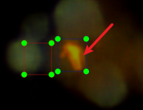 # 已经将红框（代表impus)移到图中位置，原与cluster重合

+ 同时被标记single+2*cluster
  + 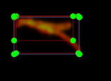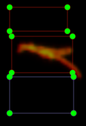# 红框代表single,蓝框代表cluster，可以看到三个标注框

+ 同时标注single+cluster

  + 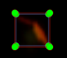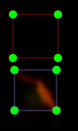# single是蓝框，cluster是红框

    

+ 一大堆标注结果
  + 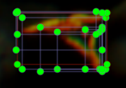# 总共6个single和1个cluster：蓝色代表single,红色代表cluster
    + 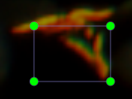 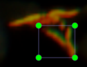 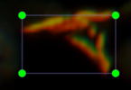 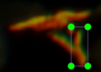 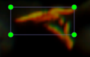 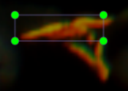 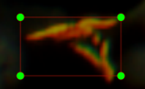 
  + 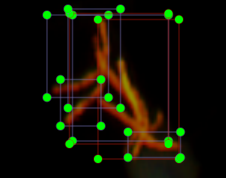 

+ cluster 相对标准
  + 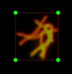 # 这种就只有一个cluster

### 正常的cluster

+ 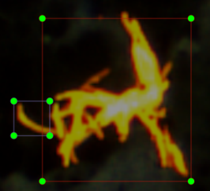 

修改记录：

single2cluster

+ 

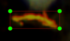 由single改为cluster

+  

  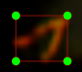 

+  

  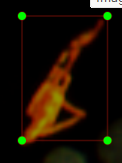 

+  

   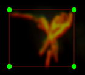 

+  以及之前的几张需要讨论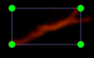  

+ 

  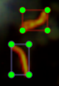 上面那个修改

+   

   

# 训练结果

训练集5800张，测试集张向银标注的0文件夹

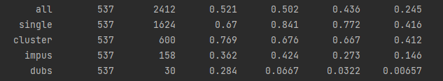

exp14 15:18

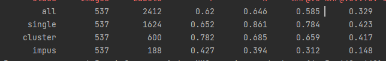

exp16 17:03

训练结果

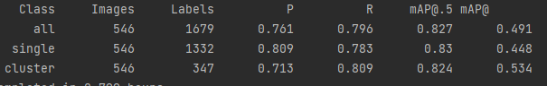

测试

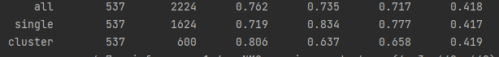

#结果比对

+   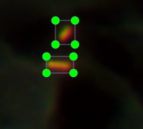  正确

+   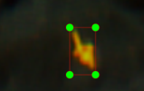 错误

+  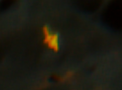 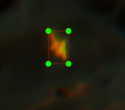 未识别
+  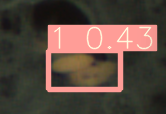 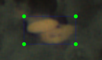 错误
+   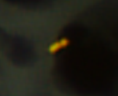 标记？
+  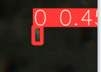  错误
+   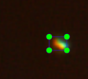 
+   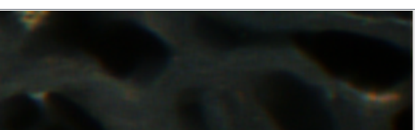 
+  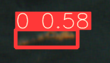   
+  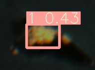 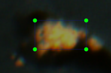 
+  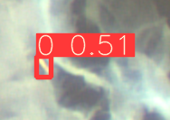 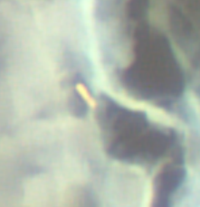 
+  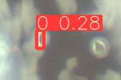 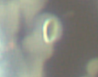 
+   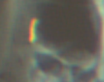 
+  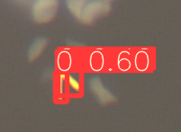 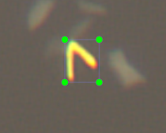 
+  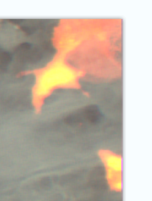 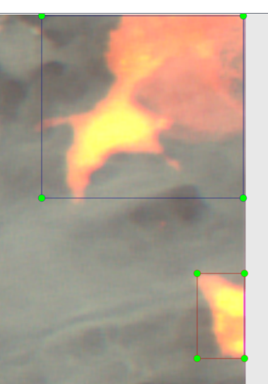 上为impus,下为cluster
+    
+    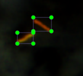 
+  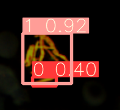  
+          

## 后续图太复杂，切换保存的txt文件

+     少标一个小物体，多标一个single
+    程序认定cluster，标记为两个single
+    外圈结果为cluster，内部还有single
+     
+   
+    
+   impus被识别成single
+    右边的出现single和cluster重复hex o
+  

# mobilenet 

+  