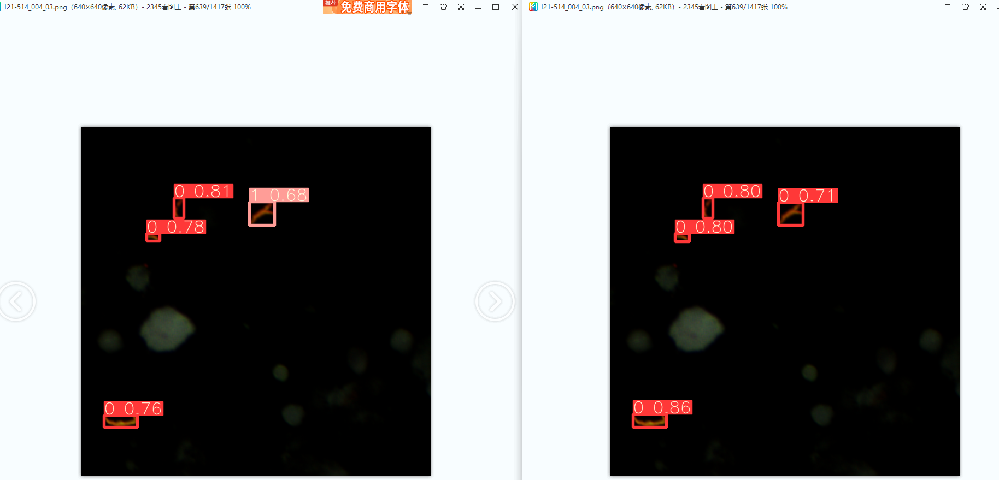
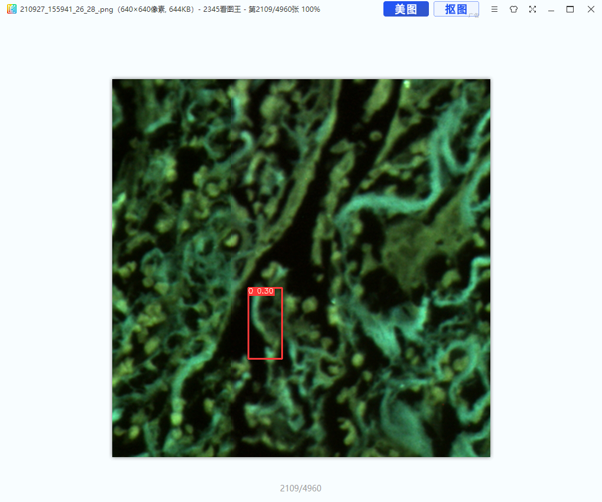
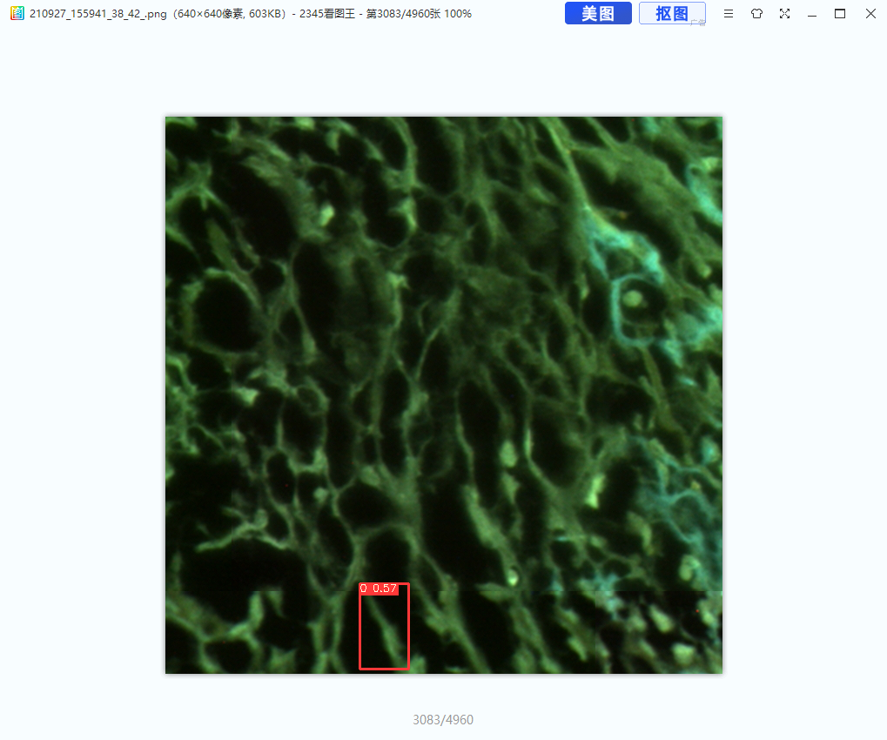

# 20210728

将backbone换成mobilenetv2[1](#id=1)

- [1]  [修改结构](https://blog.csdn.net/wa1tzy/article/details/114492726)

faster-rcnn 尝试失败，mmdection报错，待后续解决

问题：

w和h加错， x->row, y->c

# 20210810

##WBF 

尝试在detect出来的640*640图片上使用，但没有起作用，可能是检测出的目标太少

# 20210811

[mmdection](https://blog.csdn.net/qq_41251963/article/details/112940253)

myself/faster_rcnn_r50_fpn_1x_coco.py 修改data的ann_file配置

dos2unix windows传至服务器换行符啥的有可能出错

faster-rcnn 利用epoch_5.pth inference ， 结果保存在frcnn_result

# 20210824

yolox :

[修改yolox文件](https://zhuanlan.zhihu.com/p/397499216)

yolov5 新数据

整体结果：

疑似多标

这种疑似杂质标为单个

疑似虚影影响了

300轮

这里无论在100轮还是300轮都被识别成3个single，第一段+第二段、第三段、三段全

左边100轮，右边300轮

原图可能是single，两种都标为杂质

更倾向于右边

右下角single分段出现问题

左边为之前数据集，右边为原数据

200轮

temp/4

677左右有部分浅的标签去掉没标

09-06标注进度

 09-07 786张可能存在single，cluster都可以标的情况

09-07标注进度

+4数据300轮

+4数据100轮

+4数据250轮

+4数据200轮

Mish 200轮

Mish 250轮

CBAM 100

CBAM 200 

CBAM 300 

CBAM300+1

CBAM300+300

# 坐标重新nms

717/1417 存在single和cluster融合

715/1417 存在多个single可改为一个single

705/1417  存在多个single可标为单个single

698/1417 single和cluster融合

新片记录

40倍

