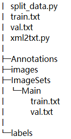

# 数据集准备

> 数据集的树形框架如下：
>
> 
>
> 上述data文件夹中：
>
> + Annotations: 用labelimg标注软件生成的xml文件
> + images：原始图像所在文件夹（与xml文件名一一对应，除了扩展名不同）
> + ImageSets: 文件夹创建一个空的Main文件夹，后续存储生成的train.txt和val.txt
> + split_data.py: 生成ImagesSets/Main文件夹下的train.txt和val.txt,对应训练集和验证集
> + xml2txt.py：将xml文件转换成txt文件保存至data文件夹下将新创建的labels文件夹

<!--more-->

split_data.py

```
import os
import random

trainval_percent = 0.2  # 可自行进行调节(设置训练和测试的比例是8：2)
train_percent = 1
xmlfilepath = 'Annotations'
txtsavepath = 'ImageSets\Main'
total_xml = os.listdir(xmlfilepath)

num = len(total_xml)
list = range(num)
tv = int(num * trainval_percent)
tr = int(tv * train_percent)
trainval = random.sample(list, tv)
val = random.sample(trainval, tr)


ftrain = open('ImageSets/Main/train.txt', 'w')
fval = open('ImageSets/Main/val.txt', 'w')

for i in list:

    name = total_xml[i][:-4] + '\n'
    if i in val:
        fval.write(name)
    else:
        ftrain.write(name)

ftrain.close()
fval.close()

```


xml2txt.py

```
import xml.etree.ElementTree as ET
import pickle
import os
from os import listdir, getcwd
from os.path import join

sets = ['train', 'val']

classes = ['single', 'cluster', 'impus', 'dubs']  # 自己训练的类别


def convert(size, box):
    dw = 1. / size[0]
    dh = 1. / size[1]
    x = (box[0] + box[1]) / 2.0
    y = (box[2] + box[3]) / 2.0
    w = box[1] - box[0]
    h = box[3] - box[2]
    x = x * dw
    w = w * dw
    y = y * dh
    h = h * dh
    return (x, y, w, h)


def convert_annotation(image_id):
    in_file = open('../data/Annotations/%s.xml' % (image_id))  
    out_file = open('../data/labels/%s.txt' % (image_id), 'w')  
    tree = ET.parse(in_file)
    root = tree.getroot()
    size = root.find('size')
    w = int(size.find('width').text)
    h = int(size.find('height').text)

    for obj in root.iter('object'):
        difficult = obj.find('difficult').text
        cls = obj.find('name').text
        if cls not in classes or int(difficult) == 1:
            continue
        cls_id = classes.index(cls)
        xmlbox = obj.find('bndbox')
        b = (float(xmlbox.find('xmin').text), float(xmlbox.find('xmax').text), float(xmlbox.find('ymin').text),
             float(xmlbox.find('ymax').text))
        bb = convert((w, h), b)
        out_file.write(str(cls_id) + " " + " ".join([str(a) for a in bb]) + '\n')


wd = getcwd()
for image_set in sets:
    if not os.path.exists('../data/labels/'):  
        os.makedirs('../data/labels/')  
    image_ids = open('../data/ImageSets/Main/%s.txt' % (image_set)).read().strip().split() 
    list_file = open('../data/%s.txt' % (image_set), 'w')  
    for image_id in image_ids:
        list_file.write('data/images/%s.png\n' % (image_id))  
        convert_annotation(image_id)
    list_file.close()
```

> 运行两个代码后，文件结构如下:
>
> 


至此，数据集划分完成。


# 修改配置文件


在用自己的数据替换掉官方同名文件及文件夹后，打开data文件夹下的coco.yaml，

```

# Train/val/test sets as 1) dir: path/to/imgs, 2) file: path/to/imgs.txt, or 3) list: [path/to/imgs1, path/to/imgs2, ..]
# path: ../data/images  # dataset root dir
train: ./data/train.txt  # train images (relative to 'path') 118287 images
val: ./data/val.txt  # train images (relative to 'path') 5000 images
# test: test-dev2017.txt  # 20288 of 40670 images, submit to https://competitions.codalab.org/competitions/20794

# Classes
nc: 4  # number of classes
names: ['single', 'cluster', 'impus', 'dubs']  # class names

```

在models文件夹下打开yolov5s.yaml,

```
nc: 4  # number of classes
```

下载对应的预训练模型

```
百度网盘链接: https://pan.baidu.com/s/1klUOdDR1tIcsuhnA2fqXdw  密码: bk6r
链接：https://pan.baidu.com/s/1vlTmjNofB5kD3BOaSy4SnA  提取码：gr8v

```

下载的预训练模型放置weights文件夹下


# 环境搭建

打开早前搭建的wsl2环境，拉取pytorch/pytorch:1.9.0-cuda11.1-cudnn8-runtime，

```
docker pull pytorch/pytorch:1.9.0-cuda11.1-cudnn8-runtime
### 如果是在服务器上运行则是
### docker pull pytorch/pytorch:1.9.0-cuda10.2-cudnn7-devel
```

完成后：

```
docker run -it --rm  --runtime=nvidia --ipc=host -v /mnt/d/yolov5-master/yolov5-master/:/workspace pytorch/pytorch:1.9.0-cuda11.1-cudnn8-runtime

```


进入环境后需要执行：

```
apt update
apt install -y wget libgl1-mesa-glx libglib2.0-dev
pip install -i https://mirror.baidu.com/pypi/simple -r requirements.txt
pip install torchvision --upgrade --force-reinstall -i https://mirror.baidu.com/pypi/simple
```


## 训练


```
python train.py --data data/coco.yaml --cfg models/yolov5s.yaml --weights weights/yolov5s.pt --batch-size 32 --epochs 100 --device 0
```


## 测试detect.py


假设训练结果存在runs/exp32 文件夹下：

修改detect.py

```
parser.add_argument('--weights', nargs='+', type=str, default='runs/train/exp32/weights/best.pt', help='model.pt path(s)')
parser.add_argument('--source', type=str, default='data/xiangyin_images', help='file/dir/URL/glob, 0 for webcam')
```

运行结果保存在run/detect文件夹中，可通过修改参数project和name来控制。

##  test.py

修改test.py

```
parser.add_argument('--weights', nargs='+', type=str, default='runs/train/exp32/weights/best.pt', help='model.pt path(s)')
```

运行结果保存在run/test文件夹中，可通过修改参数project和name来控制。

运行test.py时，可另外运行之前的代码生成test.txt和对应的labels以及ImageSets/Main下的test.txt，

```
import os
import random

trainval_percent = 1 # 可自行进行调节(设置训练和测试的比例是8：2)
train_percent = 1
xmlfilepath = 'Annotations'
txtsavepath = 'ImageSets\Main'
total_xml = os.listdir(xmlfilepath)

num = len(total_xml)
list = range(num)
tv = int(num * trainval_percent)
tr = int(tv * train_percent)
trainval = random.sample(list, tv)
val = random.sample(trainval, tr)


# ftrain = open('ImageSets/Main/train.txt', 'w')
# fval = open('ImageSets/Main/val.txt', 'w')
ftest = open('ImageSets/Main/test.txt', 'w')
for i in list:

    name = total_xml[i][:-4] + '\n'
    if i in val:
    	ftest.write(name)
        # fval.write(name)
    else:
        ftrain.write(name)

ftest.close()
```

```
import xml.etree.ElementTree as ET
import pickle
import os
from os import listdir, getcwd
from os.path import join

sets = ['test']

classes = ['single', 'cluster', 'impus', 'dubs']  # 自己训练的类别


def convert(size, box):
    dw = 1. / size[0]
    dh = 1. / size[1]
    x = (box[0] + box[1]) / 2.0
    y = (box[2] + box[3]) / 2.0
    w = box[1] - box[0]
    h = box[3] - box[2]
    x = x * dw
    w = w * dw
    y = y * dh
    h = h * dh
    return (x, y, w, h)


def convert_annotation(image_id):
    in_file = open('../data/Annotations/%s.xml' % (image_id))  
    out_file = open('../data/labels/%s.txt' % (image_id), 'w')  
    tree = ET.parse(in_file)
    root = tree.getroot()
    size = root.find('size')
    w = int(size.find('width').text)
    h = int(size.find('height').text)

    for obj in root.iter('object'):
        difficult = obj.find('difficult').text
        cls = obj.find('name').text
        if cls not in classes or int(difficult) == 1:
            continue
        cls_id = classes.index(cls)
        xmlbox = obj.find('bndbox')
        b = (float(xmlbox.find('xmin').text), float(xmlbox.find('xmax').text), float(xmlbox.find('ymin').text),
             float(xmlbox.find('ymax').text))
        bb = convert((w, h), b)
        out_file.write(str(cls_id) + " " + " ".join([str(a) for a in bb]) + '\n')


wd = getcwd()
for image_set in sets:
    if not os.path.exists('../data/labels/'):  
        os.makedirs('../data/labels/')  
    image_ids = open('../data/ImageSets/Main/%s.txt' % (image_set)).read().strip().split() 
    list_file = open('../data/%s.txt' % (image_set), 'w')  
    for image_id in image_ids:
        list_file.write('data/images/%s.png\n' % (image_id))  
        convert_annotation(image_id)
    list_file.close()
```


# docker镜像生成

> docker commit  容器id 自命名的镜像名
>
> 以后直接使用生成的镜像启动容器即可。


运行以下命令开启docker

```
docker run -it --rm  --runtime=nvidia --ipc=host -v /mnt/d/yolov5-master/yolov5-master/:/workspace pytorch/pytorch:1.9.0-cuda11.1-cudnn8-runtime###改为刚刚生成的镜像
```

​	


# 新版sq

libopenjp2.so.7 -> apt-get install libopenjp2-7-dev

libcairo.so.2 ->  apt-get install libcairo2

 libgdk_pixbuf-2.0.so.0-> apt install  

国内源地址
中国科技大学： https://pypi.mirrors.ustc.edu.cn/simple/

阿里云： http://mirrors.aliyun.com/pypi/simple/

豆瓣(douban)： http://pypi.douban.com/simple/

清华大学： https://pypi.tuna.tsinghua.edu.cn/simple/

中国科学技术大学 ：http://pypi.mirrors.ustc.edu.cn/simple/

sudo docker run -it --rm  --runtime=nvidia --ipc=host -v /media/ubuntu/disk05/Share/hzx/predict:/workspace mytorch:1.0


apt update && apt install -y  libopenjp2-7-dev libcairo2 libgtk2.0-0 openslide-tools && pip install openslide-python -i https://pypi.tuna.tsinghua.edu.cn/simple/

