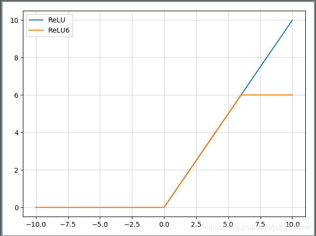

# 1、恒等函数

$$
f(x)=x \ \ \ \ \ \ \ f^{'}(x) =1
$$

# 2. 单位阶跃函数

$$
f(x)=\begin{cases}
0, & \text x<0\\
1, & \text x \geq 0
\end{cases}
\ \ \ \ \ \ \ \ \
f(x)=\begin{cases}
0, & \text x \neq 0\\
?, & \text x = 0
\end{cases}
$$

# 逻辑函数

$$
f(x)=\sigma (x)=\frac{1}{1+e^{-x}}\ \ \ \ \ \ \ \ \ 
f^{'}(x) = f(x)(1-f(x))
$$

range:(0,1),存在梯度消失的风险，原函数满足单调性，一阶导数不满足；

优点：平滑，易于求导

缺点：梯度消失；不是关于原点对称；exp耗时

# 双曲正切函数

$$
f(x)=tanh(x)=\frac{e^x - e^{-x}}{e^x + e^{-x}}\ \ \ \ \ \ \ \ 
f^{'}(x)=1-f(x)^2
$$

range:(-1,1);——解决sigmoid不是关于原点对称问题，但是梯度消失（缓解依然存在）；

# RELU

修正线性单元函数
$$
f(x)=max(0,x)\ \ \ \ \ \ \ \
f(x)=\begin{cases}
0 & \text x<0\\
1 &\text x\geq 0
\end{cases}
$$

解决梯度消失，但是存在梯度爆炸风险；因为没有exp运算，运算快于sigmoid和tanh；收敛因梯度值将快于sigmoid和tanh；但是输入如果为负数时，则将输出总是0，导致神经元不被激活。

# Swish

$$
swish(x)=x \cdot \sigma(\beta x)
$$

其中$\beta$ 是个常数或者可训练的参数。

Swish激活函数具备无上界有下届、平滑、非单调的特性，Swish在深层模型上效果优于ReLU。

# hard-swish

$$
h-swish(x)=x\frac{ReLU6(x+3)}{6}
$$

该激活函数在MobileNetV3论文中提出，相较于swish函数，具有数值稳定性好，计算速度快等优点。

 嵌入式时，计算sigmoid函数代价太大

在论文中，作者提到，虽然这种Swish非线性提高了精度，但是在嵌入式环境中，他的成本是非零的，因为在移动设备上计算sigmoid函数代价要大得多。

因此作者使用hard-Swish和hard-Sigmoid替换了ReLU6和SE-block中的Sigmoid层，但是只是在网络的后半段才将ReLU6替换为h-Swish，因为作者发现Swish函数只有在更深的网络层使用才能体现其优势。

首先是肯定了Swish的重要性，然后指出在量化模式下，Sigmoid函数比ReLU6的计算代价大的多，所以才有了这个ReLU6版本的h-Swish。

# ReLU6

抑制最大值

$$
ReLu6(x) = min(6, max(0, x))
$$

主要是为了在移动端float16的低精度的时候，也能有很好的数值分辨率，如果对ReLu的输出值不加限制，那么输出范围就是0到正无穷，而低精度的float16无法精确描述其数值，带来精度损失。

# softplus

$$
f(x)=ln(1+e^x)\ \ \ \ \ \ \ \ 
f^{'}(x)=\frac {e^x}{1+e^x}
$$

# Mish

$$
Mish(x) = x \cdot tanh(ln(1+e^x))
$$

