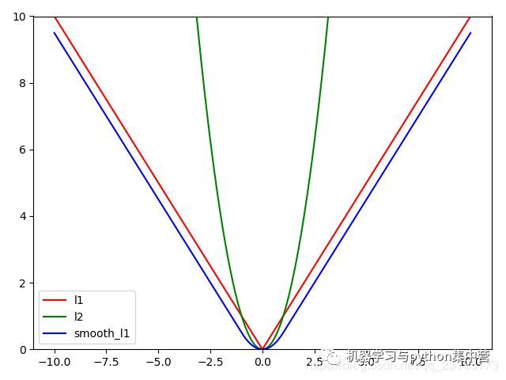
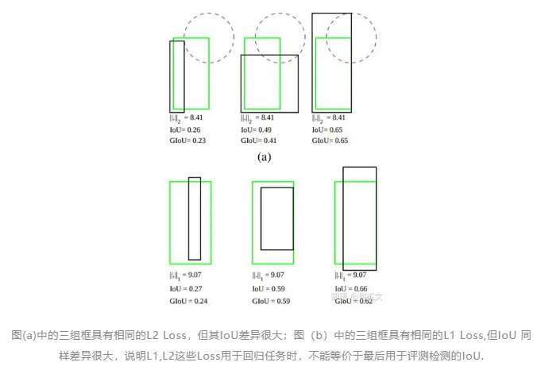
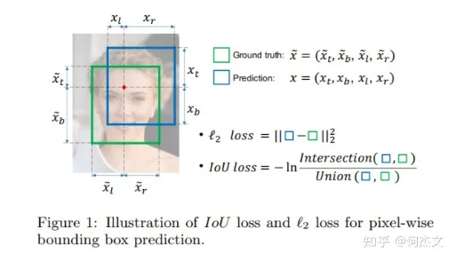
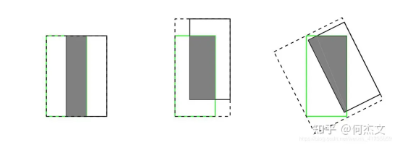
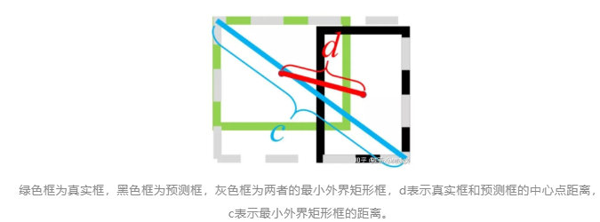

<!-- @import "[TOC]" {cmd="toc" depthFrom=1 depthTo=6 orderedList=false} -->

<!-- code_chunk_output -->

- [Smooth L1 Loss](#smooth-l1-loss)
- [IoU Loss（2016）](#iou-loss2016)
- [GIOU loss(2019)](#giou-loss2019)
- [DIoU Loss（2019）](#diou-loss2019)
- [CIoU Loss（2019）](#ciou-loss2019)
- [EIoU Loss（2021）](#eiou-loss2021)

<!-- /code_chunk_output -->

### Smooth L1 Loss

【动机】 Smooth L1 Loss完美的避开了L1和L2 Loss的缺点

1. L1 Loss的问题：损失函数对x的导数为常数，在训练后期，x很小时，如果learning rate 不变，损失函数会在稳定值附近波动，很难收敛到更高的精度。
2. L2 Loss的问题：损失函数对x的导数在x值很大时，其导数也非常大，在训练初期不稳定。
<!--more-->
【分析】
$$ smooth_{L1}(x)=\begin{cases}
    0.5x^2, &if \left|x\right| <1 \\
    \left|x\right| - 0.5, &otherwise
\end{cases}$$
SmoothL1对x的导数为：
$$\frac{dsmooth_{L1}(x)}{x} = \begin{cases}
    x, &if\left|x\right|<1\\
    \plusmn1, & otherwise
\end{cases}$$
$$
实际使用时：
L_{loc}(t^u,v)=\sum_{i \in \{x, y,w,h\}}smooth_{L1}(t_i^u-v_i)
$$
其中， $v_i=(v_x, v_y, v_w, v_h)$表示真实框坐标，$t_i^u=(t_x^u, t_y^u, t_w^u,t_h^u)$表示预测框的坐标，即分别求4个点的loss,然后相加作为Bounding Box Regression Loss.

【不足】 Smooth L1 Loss在计算目标检测的 bbox loss时，都是独立的求出4个点的 loss，然后相加得到最终的 bbox loss。这种做法的默认4个点是相互独立的，与实际不符。举个例子，当(x, y)为右下角时，w h其实只能取0。
### IoU Loss（2016）
【动机】 针对smooth L1没有考虑box四个坐标之间相关性的缺点
【分析】 通过4个坐标点独立回归Building boxes的缺点：
+ 检测评价的方式是使用IoU,而实际回归坐标框的时候是使用4个坐标点，如下图所示，是不等价的；L1或者L2 Loss相同的框，其IoU 不是唯一的；
+ 通过4个点回归坐标框的方式是假设4个坐标点是相互独立的，没有考虑其相关性，实际4个坐标点具有一定的相关性；
+ 基于L1和L2的距离的loss对于尺度不具有不变性；

IoU Loss定义如下：
$$Iouloss = -ln(IoU(bbox_{gt},bbox_{pred}))$$

实际可简化为：
$$IoUloss=1-IoU(bbox_{gt},bbox_{pred})$$
【不足】

1. 当预测框和目标框不相交，即 IoU(bbox1, bbox2)=0 时，不能反映两个框距离的远近，此时损失函数不可导，IoU Loss 无法优化两个框不相交的情况。
2. 假设预测框和目标框的大小都确定，只要两个框的相交值是确定的，其 IoU 值是相同时，IoU 值不能反映两个框是如何相交的。

### GIOU loss(2019)
【动机】 解决IoU Loss没有考虑两个框是如何相交

【分析】

GIoU定义如下：
$$GIoU = IoU - \frac{\left|C-\left|A \cup B \right|\right|}{C}$$

实际使用时:

$$Loss_{GIoU}=1-GIoU$$

1. GIoU 取值范围为 [-1, 1]，在两框重合时取最大值1，在两框无限远的时候取最小值-1；
2. 与 IoU 只关注重叠区域不同，GIoU不仅关注重叠区域，还关注其他的非重合区域，能更好的反映两者的重合度。

【不足】 当真实框完全包裹预测框的时候，IoU 和 GIoU 的值都一样，此时 GIoU 退化为 IoU, 无法区分其相对位置关系。

### DIoU Loss（2019）
【动机】 解决GIoU Loss缺点当真实框完全包裹预测框的时候，IoU 和 GIoU 的值都一样，引入距离

【分析】

基于IoU和GIoU存在的问题，作者提出了两个问题：

1. 第一：直接最小化预测框与目标框之间的归一化距离是否可行，以达到更快的收敛速度。
2. 第二：如何使回归在与目标框有重叠甚至包含时更准确、更快。

好的目标框回归损失应该考虑三个重要的几何因素：重叠面积，中心点距离，长宽比。

+ 针对问题一，作者提出了DIoU Loss,相对于GIoU Loss收敛速度更快，该Loss考虑了重叠面积和中心点距离，但没有考虑到长宽比；
+ 针对问题二，作者提出了CIoU Loss，其收敛的精度更高，以上三个因素都考虑到了。

DIoU Loss 的定义如下：

$$Loss_{DIoU}=1-IoU+\frac{\rho^2(b,b^{gt})}{c^2}$$

其中$\rho()$表示预测框和真实框中心点欧氏距离，c表示预测框和真实框最小外界矩形的对角线距离，如下图所示：

当2个框完全重合时，
$Loss_{DIOU}=Loss_{GIOU}=0$

当2个框不相交时：
$Loss_{DIOU}=Loss_{GIOU}=2$
【不足】 边框回归的三个重要几何因素：重叠面积、中心点距离和长宽比，DIoU 没有包含长宽比因素。

### CIoU Loss（2019）
【动机】 解决DIoU loss没有包含长宽比因素的不足

【分析】

CIoU的惩罚项是在DIoU的惩罚项基础上加了一个影响因子。
CIoU Loss定义为：

$$Loss_{CIOU}=1-IoU +\frac{\rho^2(b,b^{gt})}{c^2} + \alpha v$$

其中$v=\frac{4}{\pi}(\arctan {\frac{w^{gt}}{h^{gt}}} - \arctan {\frac{w}{h}})^2$
用于做trade-off的参数$\alpha=\frac{v}{(1-IoU)+v}$

【不足】 在CIoU的定义中，衡量长宽比过于复杂，从两个方面减缓了收敛速度
1. 长宽比不能取代单独的长宽，比如$w=kw^{gt},h=kh^{gt}$  都会导致v=0；
2. 从v的导数可以得到$\frac{\partial v}{\partial w}=-\frac{h}{w}\frac{\partial v}{\partial h}$  ，这说明$\frac{\partial v}{\partial w}$  和 $\frac{\partial v}{\partial h} v$ 在优化中意义相反。

### EIoU Loss（2021）
【动机】 解决CIoU的定义中不足
【亮点】 引入了解决样本不平衡问题的Focal Loss思想

【分析】将CIOU的$\alpha v$取代为$\frac{\rho^2(w,w^{gt})}{C_w^2}+\frac{\rho^2(h,h^{gt})}{C_h^2}$

EIoU Loss的定义为：

$$Loss_{EIoU}=1-IoU + \frac{\rho^2(b,b^{gt})}{c^2}+ \frac{\rho^2(w,w^{gt})}{C_w^2}+\frac{\rho^2(h,h^{gt})}{C_h^2}$$
Focal-EIoU Loss的定义为：
focal loss可以理解为对损失加权，常见的分类focal loss为：
$FL(p_t)=-\alpha_t(1-p_t)^\gamma log(p_t)$
最后得到：
$Loss_{focal-EIoU}=IoU^\gamma Loss_{EIoU}$